# Implementation Plan: Cosm (`cosm`) - AI-Native Polyglot AST SCM & Target Compilation System

An AI-native Source Control Management (SCM) system built in **Go (Golang)** for **polyglot cloud projects** (Terraform HCL, Go backends, TypeScript frontends, and API schemas). The system stores software as a **crash-resilient, content-addressed AST Merkle-DAG**, backed by an embedded pure-Go SQLite WAL graph engine, an event-sourced Oplog, an autonomous Go Build/Shipping Sidecar, and dynamic Target Environment viewing projections.

## Architecture Highlights

- **Go-Native Architecture (`go 1.22+`)**:
  - **Native AST Advantage**: First-class AST parsing and SSA interpretation using `go/parser`, `go/ast`, `golang.org/x/tools/go/ssa`, and `github.com/hashicorp/hcl/v2` (native Go library from HashiCorp).
  - **Zero-CGO Embedded Storage**: Uses pure-Go SQLite (`modernc.org/sqlite`) in Write-Ahead Log (`WAL`) mode for `.cosm/graph.db` paired with content-addressed atomic disk storage under `.cosm/objects/`.
  - **Agent APIs & Interaction**: High-performance gRPC and in-process Go APIs for AI agent swarms, plus a Cobra-based CLI (`cosm`) and Bubble Tea TUI.
  - **Testing**: Standard Go test suite (`go test -v ./...`), with `terraform fmt` and `terraform validate` automated hooks.

---

## 1. Durable Storage Architecture & Directory Layout (`.cosm/`)

```
my-cloud-project/
├── .cosm/
│   ├── config.json                     # Workspace config, targets, default universe
│   ├── objects/                        # Content-addressed immutable AST object store
│   │   ├── 4f/
│   │   │   └── 8a2e...bin              # Protobuf-serialized AST symbol/component nodes
│   │   └── e1/
│   │       └── 9b4c...bin
│   ├── graph.db                        # Pure-Go SQLite WAL: Semantic edges, universes, and oplog
│   │   ├── tables:
│   │   │   ├── nodes                   # (node_id, language, type, merkle_hash, created_at)
│   │   │   ├── semantic_edges          # (source_id, target_id, edge_type, contract_id)
│   │   │   ├── oplog_events            # (event_id, timestamp_ms, universe_id, action, payload)
│   │   │   ├── universe_heads          # (universe_id, head_manifest_hash, status)
│   │   │   └── lineage_records         # (record_id, node_id, user_id, session_id, agent_id, ...)
│   ├── graph.db-wal                    # SQLite Write-Ahead Log (crash resilience)
│   ├── vector.db                       # Vector embeddings for semantic search & agent memory
│   └── attestations/                   # Ed25519 cryptographic signatures for committed nodes
```

---

## 2. Go Data Model Primitives (`pkg/core/schema.go`)

```go
package core

import "time"

type Language string
const (
    LangGo         Language = "go"
    LangHCL        Language = "hcl"
    LangTypeScript Language = "typescript"
    LangPython     Language = "python"
    LangOpenAPI    Language = "openapi"
)

type ComponentType string
const (
    CompService   ComponentType = "service"
    CompInfra     ComponentType = "infra"
    CompFrontend  ComponentType = "frontend"
    CompContract  ComponentType = "contract"
)

type EdgeType string
const (
    EdgeCalls        EdgeType = "CALLS"
    EdgeConsumesAPI  EdgeType = "CONSUMES_API"
    EdgeDeploysTo    EdgeType = "DEPLOYS_TO"
    EdgeBindsEnv     EdgeType = "BINDS_ENV"
    EdgeDependsOn    EdgeType = "DEPENDS_ON"
)

// LineageEnvelope records the unbroken causal pedigree from user request to code node
type LineageEnvelope struct {
    UserID              string    `json:"user_id"`
    UserPrompt          string    `json:"user_prompt"`
    SessionID           string    `json:"session_id"`
    OrchestratorAgentID string    `json:"orchestrator_agent_id"`
    ExecutingAgentID    string    `json:"executing_agent_id"`
    LLMVersion          string    `json:"llm_version"`
    GenerationParams    string    `json:"generation_params"` // JSON string: temp, seed, etc.
    Intent              string    `json:"intent"`
    Timestamp           time.Time `json:"timestamp"`
    SignatureEd25519    []byte    `json:"signature_ed25519"`
}

// ASTSymbolNode represents an individual function, struct, resource, or component
type ASTSymbolNode struct {
    NodeID            string          `json:"node_id"` // Content-addressed SHA-256
    Language          Language        `json:"language"`
    NodeType          string          `json:"node_type"` // e.g., "FunctionDecl", "ResourceBlock"
    Identifier        string          `json:"identifier"`
    ASTPayload        []byte          `json:"ast_payload"` // Serialized AST binary
    LocalDependencies []string        `json:"local_dependencies"`
    Lineage           LineageEnvelope `json:"lineage"`
}

// CrossBoundaryEdge links symbols across different language domains
type CrossBoundaryEdge struct {
    SourceNodeID     string   `json:"source_node_id"`
    TargetNodeID     string   `json:"target_node_id"`
    Type             EdgeType `json:"type"`
    ContractSchemaID string   `json:"contract_schema_id,omitempty"`
}

// WorkspaceManifestNode is the content-addressed root of the repository state
type WorkspaceManifestNode struct {
    WorkspaceID    string              `json:"workspace_id"`
    UniverseID     string              `json:"universe_id"`
    MerkleRootHash string              `json:"merkle_root_hash"`
    Components     []string            `json:"components"` // Component node hashes
    CrossEdges     []CrossBoundaryEdge `json:"cross_edges"`
    Lineage        LineageEnvelope     `json:"lineage"`
}
```

---

## 3. Fully Inclusive Task Dependency Graph

```mermaid
graph TD
    classDef epic fill:#2d3748,stroke:#4a5568,stroke-width:2px,color:#fff;
    classDef task fill:#1a365d,stroke:#2b6cb0,stroke-width:1px,color:#e2e8f0;
    classDef test fill:#22543d,stroke:#38a169,stroke-width:1px,color:#c6f6d5;
    classDef milestone fill:#744210,stroke:#d69e2e,stroke-width:2px,color:#fefcbf;

    subgraph E1["Epic 1: Go-Native Polyglot AST Codecs"]
        T1_1["T1.1: Core Go Schema & Merkle Hasher<br/>(pkg/core/schema.go, hasher.go)"]:::task
        T1_2["T1.2: Terraform HCL Parser & Formatter<br/>(hashicorp/hcl/v2 + terraform fmt/validate)"]:::task
        T1_3["T1.3: Go AST & SSA Codec<br/>(go/parser, go/ast, go/types symbol extractor)"]:::task
        T1_4["T1.4: TypeScript / ESTree Codec<br/>(esbuild AST / tree-sitter parser)"]:::task
        T1_5["T1.5: Cross-Boundary Semantic Edge Linker<br/>(CONSUMES_API, DEPLOYS_TO, BINDS_ENV)"]:::task
    end

    subgraph E2["Epic 2: Durable Pure-Go Storage Engine (.cosm/)"]
        T2_1["T2.1: Content-Addressed Immutable Blob Store<br/>(pkg/storage/blobstore.go with atomic fsync)"]:::task
        T2_2["T2.2: Pure-Go SQLite WAL Graph & Oplog Engine<br/>(modernc.org/sqlite + recursive CTEs)"]:::task
        T2_3["T2.3: Universe & Branch State Manager<br/>(Zero-copy non-linear parallel universes)"]:::task
        T2_4["T2.4: Durable Vector & Intent Memory Index<br/>(Embedded vector search for agent prompts)"]:::task
    end

    subgraph E3["Epic 3: Multi-Tier Lineage & Provenance Tracking"]
        T3_1["T3.1: Full-Stack Ancestry Graph Traversal<br/>(User Prompt -> Session -> Subagent -> AST Node)"]:::task
        T3_2["T3.2: Blast-Radius & Model Auditing Query Engine<br/>(Query by agent_id, model, or prompt hash)"]:::task
        T3_3["T3.3: Cryptographic Attestations<br/>(Ed25519 signing & verification in Go)"]:::task
    end

    subgraph E4["Epic 4: Dynamic Materialization & Viewing Engine"]
        T4_1["T4.1: Polyglot AST-to-Source Hydrator<br/>(HCL, Go, TS, Python syntax reconstitutor)"]:::task
        T4_2["T4.2: Terminal & Chat Viewer Component<br/>(Lipgloss syntax highlighting & lineage cards)"]:::task
        T4_3["T4.3: On-Demand Project Disk Materializer<br/>(Materialize full AST workspace to disk)"]:::task
        T4_4["T4.4: Virtual File System (VFS) Hook<br/>(In-memory OS file provider for tools)"]:::task
    end

    subgraph E5["Epic 5: Go Build & Shipping Sidecar Engine"]
        T5_1["T5.1: Build Target Specification Model<br/>(Go binaries, HCL plans, frontend bundles)"]:::task
        T5_2["T5.2: Ephemeral Toolchain Staging Runner<br/>(Isolated RAM/tmp workspaces for builds)"]:::task
        T5_3["T5.3: Terraform Validation & Planning Runner<br/>(Automated terraform fmt & validate)"]:::task
        T5_4["T5.4: Go & Frontend Incremental Compiler<br/>(In-memory SSA execution / fast go build)"]:::task
        T5_5["T5.5: Composite Service Packager & Shipper<br/>(Local container / service runtime deployment)"]:::task
    end

    subgraph E6["Epic 6: Target Viewing & Live Environment Previews"]
        T6_1["T6.1: Target Environment Projector<br/>(Compare Universe AST against Target Staging/Prod)"]:::task
        T6_2["T6.2: Cross-Domain Topology Graph Visualizer<br/>(UI -> Go API -> Cloud Infra Graph)"]:::task
        T6_3["T6.3: Ephemeral Local Preview Sandbox<br/>(Live Hot-Reload Runtime against Target View)"]:::task
    end

    subgraph E7["Epic 7: Git Compatibility Shim Layer"]
        T7_1["T7.1: Git CLI Command Interceptor<br/>(git status, diff, add, commit, log, checkout)"]:::task
        T7_2["T7.2: Synthetic .git Object Generator<br/>(Dynamic Tree/Commit/Blob Adapter)"]:::task
        T7_3["T7.3: Bi-directional Git Remote Sync<br/>(GitHub/GitLab Remote Push/Pull in Go)"]:::task
    end

    subgraph E8["Epic 8: Multi-Agent Collaboration & Agent APIs"]
        T8_1["T8.1: High-Speed Agent gRPC & In-Process API<br/>(Real-time AST mutation & query service)"]:::task
        T8_2["T8.2: Semantic Cross-Boundary Conflict Engine<br/>(Flag breaking changes across Go & Frontend)"]:::task
        T8_3["T8.3: Multi-Universe Fitness & Benchmark Evaluator<br/>(Parallel Universe Tree Collapsing)"]:::task
    end

    subgraph E9["Epic 9: Developer Interfaces & Verification Suite"]
        T9_1["T9.1: Developer CLI ('cosm')<br/>(Cobra-based commands: init, view, lineage, ship)"]:::task
        T9_2["T9.2: Interactive Bubble Tea TUI Dashboard<br/>(Terminal visualizer for graph & lineage)"]:::task
        T9_3["T9.3: Automated Go Test Suite (go test ./...)<br/>(Durability, crash recovery, codecs, Git shim)"]:::task
        T9_4["T9.4: End-to-End Polyglot Cloud Project Demo<br/>(Full Terraform + Go + React workflow)"]:::task
    end

    %% Dependencies
    T1_1 --> T1_2 & T1_3 & T1_4
    T1_2 & T1_3 & T1_4 --> T1_5

    T1_1 & T1_5 --> T2_1
    T2_1 --> T2_2
    T2_2 --> T2_3
    T2_1 --> T2_4

    T1_1 --> T3_1
    T2_2 --> T3_1
    T3_1 --> T3_2
    T1_1 & T3_1 --> T3_3

    T1_2 & T1_3 & T1_4 --> T4_1
    T2_1 --> T4_1
    T4_1 --> T4_2
    T3_1 --> T4_2
    T4_1 --> T4_3
    T4_3 --> T4_4

    T1_5 --> T5_1
    T4_3 & T4_4 --> T5_2
    T1_2 & T5_2 --> T5_3
    T1_3 & T1_4 & T5_2 --> T5_4
    T5_1 & T5_3 & T5_4 --> T5_5

    T5_1 & T5_5 --> T6_1
    T1_5 & T4_2 --> T6_2
    T5_2 & T6_1 --> T6_3

    T4_1 & T2_2 --> T7_1
    T2_1 & T4_3 --> T7_2
    T7_1 & T7_2 --> T7_3

    T2_2 --> T8_1
    T1_5 & T8_1 --> T8_2
    T2_3 & T5_5 & T8_2 --> T8_3

    T2_3 & T3_1 & T4_2 & T5_5 & T6_1 & T7_1 --> T9_1
    T4_2 & T6_2 & T2_3 --> T9_2
    T1_1 & T2_1 & T2_2 & T3_1 & T4_1 & T5_3 & T5_4 & T7_1 & T8_2 --> T9_3
    T9_1 & T9_2 & T9_3 --> T9_4:::milestone
```



---

## 4. Detailed Task Breakdown

### Epic 1: Go-Native Polyglot AST Codecs
- [x] **T1.1: Core Go Schema & Merkle Hasher**
  - Go data structures for AST nodes, components, workspaces, edges, and lineage envelopes; deterministic SHA-256 Merkle hasher.
  - Output: `pkg/core/schema.go`, `pkg/core/hasher.go`
- [x] **T1.2: Terraform HCL Parser & Formatter**
  - Uses `github.com/hashicorp/hcl/v2` to parse HCL into AST nodes; hooks into `terraform fmt` and `terraform validate`.
  - Output: `pkg/codecs/hcl/parser.go`, `pkg/codecs/hcl/formatter.go`
- [x] **T1.3: Go AST & SSA Codec**
  - Uses `go/parser`, `go/ast`, and `go/types` to decompose Go code into functions, structs, interfaces, and route bindings.
  - Output: `pkg/codecs/golang/parser.go`, `pkg/codecs/golang/symbols.go`
- [x] **T1.4: TypeScript / ESTree Codec**
  - Parses TypeScript and React TSX into component nodes and extracts API fetch calls.
  - Output: `pkg/codecs/typescript/parser.go`
- [x] **T1.5: Python AST Codec**
  - Parses Python and FastAPI/Flask into function, class, route, and environment binding nodes.
  - Output: `pkg/codecs/python/parser.go`
- [x] **T1.6: Cross-Boundary Semantic Edge Linker**
  - Builds the multi-language dependency graph (`CONSUMES_API`, `DEPLOYS_TO`, `BINDS_ENV`).
  - Output: `pkg/core/crossboundary.go`

### Epic 2: Durable Pure-Go Storage Engine (`.cosm/`)
- [x] **T2.1: Content-Addressed Immutable Blob Store**
  - Disk-backed immutable storage under `.cosm/objects/` with atomic write-and-rename (`fsync`) semantics.
  - Output: `pkg/storage/blobstore.go`
- [x] **T2.2: Pure-Go SQLite WAL Graph & Oplog Engine**
  - Embedded SQLite database (`modernc.org/sqlite`) in WAL mode storing semantic edges, universe heads, and the append-only event Oplog with recursive CTE queries.
  - Output: `pkg/storage/graphengine.go`, `pkg/storage/oplog.go`
- [x] **T2.3: Universe & Branch State Manager**
  - Zero-copy micro-universe branching engine tracking active frontier heads in SQLite.
  - Output: `pkg/storage/universe.go`
- [x] **T2.4: Durable Vector & Intent Memory Index**
  - Embedded vector search linking natural language prompts and agent reasoning to AST nodes.
  - Output: `pkg/storage/vectorindex.go`

### Epic 3: Multi-Tier Lineage & Provenance Tracking
- [x] **T3.1: Full-Stack Ancestry Graph Traversal**
  - Traverses the causal pedigree: `User Prompt` $\rightarrow$ `Session ID` $\rightarrow$ `Orchestrator` $\rightarrow$ `Subagent` $\rightarrow$ `Model Params` $\rightarrow$ `AST Node`.
  - Output: `pkg/lineage/tracer.go`
- [x] **T3.2: Blast-Radius & Model Auditing Query Engine**
  - Queries all AST nodes touched by a specific agent, session, model checkpoint, or prompt hash.
  - Output: `pkg/lineage/audit.go`
- [x] **T3.3: Cryptographic Attestations**
  - Ed25519 digital signature signing and verification for AST payloads and lineage envelopes.
  - Output: `pkg/lineage/attestation.go`

### Epic 4: Dynamic Materialization & Viewing Engine
- [x] **T4.1: Polyglot AST-to-Source Hydrator**
  - Reconstitutes raw AST nodes into clean, formatted HCL, Go, TypeScript, and Python source text.
  - Output: `pkg/materialize/hydrator.go`
- [x] **T4.2: Terminal & Chat Viewer Component**
  - Terminal viewer using `lipgloss` rendering syntax highlighting, diffs, and provenance cards.
  - Output: `pkg/materialize/viewer.go`
- [x] **T4.3: On-Demand Project Disk Materializer**
  - Projects the AST graph onto physical disk directories for legacy compilers and human export.
  - Output: `pkg/materialize/exporter.go`
- [x] **T4.4: Virtual File System (VFS) Hook**
  - In-memory filesystem interface for dynamic fileless hydration.
  - Output: `pkg/materialize/vfs.go`

### Epic 5: Go Build & Shipping Sidecar Engine (`cosm ship`)
- [x] **T5.1: Build Target Specification Model**
  - Schema declaring targets (e.g., `target:local-service`, `target:cloud-run`, `target:static-web`).
  - Output: `pkg/shipping/targetspec.go`
- [x] **T5.2: Ephemeral Toolchain Staging Runner**
  - Staging manager executing builds in isolated RAM/temp directories without touching the repo.
  - Output: `pkg/shipping/staging.go`
- [x] **T5.3: Terraform Validation & Planning Runner**
  - Automates `terraform fmt -check` and `terraform validate` during pre-commit and shipping runs.
  - Output: `pkg/shipping/terraform_runner.go`
- [x] **T5.4: Go & Frontend Incremental Compiler**
  - Runs in-memory SSA interpretation or incremental `go build` and frontend bundlers for affected subgraphs.
  - Output: `pkg/shipping/compiler.go`
- [x] **T5.5: Composite Service Packager & Shipper**
  - Packages compiled binaries, static assets, and cloud infra configs into runnable local services.
  - Output: `pkg/shipping/packager.go`

### Epic 6: Target Viewing & Live Environment Previews
- [x] **T6.1: Target Environment Projector**
  - Compares the active Universe AST state against Target Staging/Production environments.
  - Output: `pkg/target/projector.go`
- [x] **T6.2: Cross-Domain Topology Graph Visualizer**
  - Generates cross-domain topology graphs: Frontend $\rightarrow$ Go/Python API $\rightarrow$ Cloud Infra.
  - Output: `pkg/target/topology.go`
- [x] **T6.3: Ephemeral Local Preview Sandbox**
  - Launches live preview instances of the full-stack project for interactive testing.
  - Output: `pkg/target/sandbox.go`

### Epic 7: Git Compatibility Shim Layer
- [x] **T7.1: Git CLI Command Interceptor**
  - Drop-in proxy mapping standard Git commands (`status`, `diff`, `add`, `commit`, `log`, `checkout`) to AST Oplog operations.
  - Output: `pkg/gitshim/interceptor.go`
- [x] **T7.2: Synthetic .git Object Generator**
  - Dynamically synthesizes Git tree, commit, and blob objects from the AST Merkle DAG.
  - Output: `pkg/gitshim/synthetic_repo.go`
- [x] **T7.3: Bi-directional Git Remote Sync**
  - Pulls and pushes from GitHub/GitLab remotes by translating between AST DAGs and Git commits.
  - Output: `pkg/gitshim/remote_bridge.go`

### Epic 8: Multi-Agent Collaboration & Agent APIs
- [x] **T8.1: High-Speed Agent gRPC & In-Process API**
  - Go gRPC server and Go client SDK providing millisecond AST mutation, validation, and querying for agent swarms.
  - Output: `pkg/api/server.go`, `pkg/api/client.go`
- [x] **T8.2: Semantic Cross-Boundary Conflict Engine**
  - Detects semantic contract breakage across language boundaries (e.g. backend route changes breaking frontend fetch calls).
  - Output: `pkg/collaboration/conflict_engine.go`
- [x] **T8.3: Multi-Universe Fitness & Benchmark Evaluator**
  - Evaluates parallel candidate universes and collapses the tree to the winning implementation.
  - Output: `pkg/collaboration/evaluator.go`

### Epic 9: Developer Interfaces & Verification Suite
- [x] **T9.1: Developer CLI (`cosm`)**
  - Complete CLI exposing: `cosm init`, `cosm add`, `cosm commit`, `cosm status`, `cosm view`, `cosm topology`, `cosm lineage`, `cosm blast-radius`, `cosm universe`, `cosm proposal`, `cosm import`, `cosm export`, `cosm dashboard`, `cosm ship`, `cosm git`.
  - Output: `cmd/cosm/main.go`, `cmd/cosm/cli_test.go`
- [x] **T9.2: Interactive Bubble Tea TUI Dashboard**
  - Terminal User Interface for visual graph exploration, universe selection, and lineage inspection.
  - Output: `pkg/tui/app.go`, `pkg/tui/tui_test.go`
- [x] **T9.3: Automated Go Test Suite (`go test ./...`)**
  - Unit and integration tests across all packages (storage, WAL, codecs, lineage, shipping, collabs, CLI).
  - Output: `pkg/.../*_test.go`, `cmd/cosm/*_test.go`
- [x] **T9.4: End-to-End Polyglot Cloud Project Demo**
  - Live walkthrough with Terraform validation (`terraform fmt`/`validate`), Go compilation, lineage tracing, and target shipping.
  - Output: `examples/polyglot_demo/`

---

## 5. Verification Plan

### Automated Tests (`go test -v ./...`)
```bash
go test -v -race ./pkg/...
```
Key automated test suites:
1. **Crash Recovery & Storage Durability**:
   - Write AST nodes and semantic edges into `.cosm/objects/` and SQLite WAL.
   - Forcefully close DB connection / simulate crash; reopen and verify 100% data integrity with zero corrupt records.
2. **Polyglot Parsing Fidelity**:
   - Parse Terraform HCL with `hashicorp/hcl/v2` $\rightarrow$ verify resource graph $\rightarrow$ run `terraform fmt` check.
   - Parse Go files with `go/parser` $\rightarrow$ extract struct and function symbols.
   - Parse TypeScript with `esbuild` $\rightarrow$ extract JSX component and route calls.
3. **Cross-Boundary Contract Validation**:
   - Modify Go handler signature $\rightarrow$ assert that conflict engine detects breaking changes in dependent TypeScript components.
4. **Git Shim Parity**:
   - Execute `cosm git status`, `cosm git diff`, and `cosm git commit` $\rightarrow$ verify synthetic Git tree generation matches Oplog state.
5. **Multi-Tier Lineage Pedigree**:
   - Commit AST mutation with full provenance $\rightarrow$ execute `Tracer.GetAncestry(nodeID)` and assert exact match of `user_prompt`, `session_id`, `agent_id`, and `llm_version`.

### Manual CLI & Interactive Verification
1. **Initialize Project**:
   ```bash
   cosm init
   ```
2. **Ingest Polyglot Cloud Components**:
   ```bash
   cosm add infra/main.tf --intent "Provision Cloud Run service"
   cosm add server/main.go --intent "Implement REST API handler"
   cosm add client/App.tsx --intent "Implement UI view"
   ```
3. **Inspect Topology & Lineage**:
   ```bash
   cosm topology
   cosm lineage <symbol_node_id>
   ```
4. **Validate & Ship to Target**:
   ```bash
   cosm ship --target local-preview
   ```

---

## 6. Pull Request & Proposal Model (Git Compatibility & Agent Workflows)

Comprehensive developer and agent how-to guides are documented in [`docs/HOW_TO_PR_AND_COLLABORATION.md`](file:///Users/jasondavenport/GitHub/future-of-git/docs/HOW_TO_PR_AND_COLLABORATION.md).

### 6.1 Universe Proposals vs. Traditional Git PRs
- **Semantic Delta**: In `cosm`, a Pull Request is represented as a **Universe Proposal** containing AST symbol additions/modifications, cross-boundary contract edges, and cryptographic lineage envelopes rather than line-by-line text diffs.
- **Target Sandbox Integration**: Each proposal is accompanied by an ephemeral target preview instance (`cosm ship`) and automated verification results (`terraform validate`, Go compilation, React bundling).

### 6.2 Dual Git Bridge Workflow
- **Outbound (`cosm` -> GitHub PR)**: `cosm git push origin <universe>:<branch>` synthesizes Git tree/commit objects and generates a GitHub PR description formatted with Merkle hashes, in-toto attestations, and interactive Mermaid topology diagrams.
- **Inbound (GitHub PR -> `cosm`)**: `cosm git import-pr <pr_number>` pulls Git commit trees, parses them into AST subgraphs, and builds an isolated micro-universe for local cross-domain analysis.

### 6.3 AI Agent Swarm Collaboration Patterns
- **Autonomous Propose**: Worker agents fork micro-universes via the Go SDK (`pkg/api/client.go`), mutate AST symbols, attach Lineage Envelopes with Ed25519 signatures, and submit proposals.
- **Auto-Collapse / Evaluator**: Orchestrator agents use `pkg/collaboration/evaluator.go` to compute fitness scores across competing candidate universes and auto-collapse the highest-performing universe into `universe-main`.

---

## 7. Repository Onboarding & AST Object Mutation Engine

### 7.1 Existing Repository Onboarding Pipeline (`pkg/onboarding/`)

#### A. Ingestion Modes
1. **Snapshot Ingestion (`cosm import-repo --path <dir>`)**:
   - Scans directory tree, honoring `.gitignore` rules.
   - Detects polyglot project boundaries (`go.mod`, `package.json`, `pyproject.toml`, `requirements.txt`, `*.tf`).
   - Maps folder trees into structured `core.ComponentNode`s (`CompService`, `CompFrontend`, `CompInfra`, `CompContract`).
   - Decomposes source files into content-addressed `ASTSymbolNode`s via language codecs (`golang`, `python`, `typescript`, `hcl`).
   - Stores non-AST files (documentation, YAML configs, images, binaries) as content-addressed `RawBlobNode`s to guarantee 100% data preservation with zero loss.
   - Runs `pkg/core/crossboundary.go` to automatically discover and wire cross-domain contracts (`CONSUMES_API`, `DEPLOYS_TO`, `BINDS_ENV`).
   - Persists blobs to `.cosm/objects/` and builds the root `WorkspaceManifestNode`.

2. **Historical Git Ingestion (`cosm git ingest-history`)**:
   - Traverses the historical Git commit DAG in topological order.
   - Converts commit-by-commit diffs into AST mutations recorded in the event-sourced Oplog.
   - Synthesizes `LineageEnvelope`s from Git commit metadata (`user_id` = author, `intent` = commit message, `timestamp` = committer date, `git_legacy_hash` = Git commit SHA).
   - Maintains a bidirectional lookup index in SQLite (`git_commit_map: git_sha <-> cosm_manifest_hash`).

### 7.2 AST Object Mutation Engine (`pkg/mutation/`)

#### A. Semantic AST Surgery (`cosm symbol edit <symbol_id>`)
- Allows developers and AI agents to surgically replace or modify an individual function, struct, resource block, or route handler in isolation.
- Only the target symbol is re-serialized and hashed into `.cosm/objects/`.
- Computes new Merkle root while deduplicating all unchanged sibling symbols (zero unnecessary disk I/O).

#### B. Text-Based File Synchronization (`cosm add <file>`)
- Re-parses modified working tree files into AST symbols.
- Compares AST hashes against the prior manifest; unchanged symbols are deduplicated automatically.

#### C. Cross-Boundary Contract Validation & Blast Radius
- When an exported API route, data struct, or Terraform variable is modified, the mutation engine executes recursive CTE queries in `.cosm/graph.db`.
- Pinpoints all downstream dependent symbols across frontend, backend, and infrastructure tiers before applying the change.

#### D. Cryptographic Lineage Appending
- Appends unbroken causal lineage (`parent_node_id`, `executing_agent_id`, `user_prompt`, `session_id`, `llm_version`), cryptographically signed with Ed25519.

---

## 8. Pull Request Presentation & Dual Critique System (`pkg/review/`)

### 8.1 AST-Native Proposal Presentation Model
- **Executive Provenance Card**: Shows originating user prompt, session ID, orchestrator agent, and cryptographic signature validity.
- **Cross-Domain Topology & Contract Delta Graph**: Visualizes new, modified, or broken cross-boundary contracts across frontend (`CONSUMES_API`), backend (`DEPLOYS_TO`), and cloud infrastructure (`BINDS_ENV`).
- **AST Symbol Cards**: Self-contained code diff cards for each modified function, struct, resource block, or route with syntax highlighting and dependency links.
- **Live Target Sandbox & Build Badge**: Embeds ephemeral preview endpoint status (`cosm ship`) with automated `terraform validate`, `go build`, and frontend bundling results.
- **Lineage Pedigree Inspector**: Clickable causal breadcrumb path: $\text{User Prompt} \rightarrow \text{Session} \rightarrow \text{Agent} \rightarrow \text{Model} \rightarrow \text{AST Node}$.

### 8.2 Dual Critique Architecture: Human vs. Agent

#### A. Human Critique Workflow
- **Symbol-Level Granular Annotations**: Humans comment directly on AST symbols (e.g. `HandleGetUsers`), preventing line-number drift.
- **Symbol-Level Partial Approvals**: Humans selectively approve individual AST symbols while requesting revisions on others.
- **Intent-Driven Remediation Prompts**: Reviewers input natural language prompts (e.g. *"Refactor HandleGetUsers to return 404 when missing"*) that trigger automated worker agent revisions.
- **Interactive TUI & Terminal Views**: `cosm proposal view <id>` displays interactive Lipgloss review cards with syntax coloring.

#### B. Autonomous AI Agent Critique Protocol
- **Structured Machine Review Ingestion**: Reviewer agents query `pkg/review/` API, receiving structured AST deltas, cross-boundary contract changes, and compiler test diagnostics.
- **Multi-Vector Automated Fitness Scoring**:
  1. *Contract Integrity*: Verifies frontend API calls match backend route signatures.
  2. *Security & IAM Audit*: Flags permissive IAM policies or exposed ports in Terraform HCL.
  3. *Scope & Drift Check*: Asserts that changes do not exceed the intent of the prompt.
  4. *Provenance Verification*: Validates Ed25519 digital signatures on all lineage records.
- **Structured Machine Critique Output**: Reviewer agents emit actionable critiques with `symbol_id`, `severity`, and `remediation_prompt`.
- **Autonomous Swarm MCTS Auto-Repair**: Worker agents automatically consume `REQUEST_CHANGES` critiques, apply surgical AST mutations, and submit updated proposal revisions.

---

## 9. Full Verification & Test Suite Matrix

| Test Suite | Package | Objective / Validation |
| :--- | :--- | :--- |
| **`TestRepoOnboarding_Snapshot`** | `pkg/onboarding` | Ingest multi-language repo (Go, Python, TS, Terraform); verify all components, symbols, and cross-boundary edges are discovered. |
| **`TestRepoOnboarding_HistoricalGit`** | `pkg/onboarding` | Replay 20+ historical Git commits; assert 1:1 mapping between Git SHAs and `.cosm` Merkle roots. |
| **`TestRepoOnboarding_RawBlobs`** | `pkg/onboarding` | Ingest non-AST files (markdown, YAML, images, binaries); verify lossless hydration on export. |
| **`TestAST_RoundtripIsomorphism`** | `pkg/materialize` | $\text{Source} \rightarrow \text{AST} \rightarrow \text{Hydrate} \rightarrow \text{AST}$: Verify strict structural AST equality. |
| **`TestMutation_SymbolSurgery`** | `pkg/mutation` | Mutate 1 symbol in isolation; verify new Merkle root is generated and unchanged sibling symbols are deduplicated. |
| **`TestMutation_CrossBoundaryBlastRadius`** | `pkg/mutation` | Mutate a backend route; assert that dependent frontend API client nodes are correctly flagged in blast-radius audit. |
| **`TestMutation_LineageProvenance`** | `pkg/mutation` | Mutate symbol across 3 agent iterations; trace full ancestry chain back to root user prompt. |
| **`TestReview_ProposalCardRenderer`** | `pkg/review` | Render AST proposal cards with topology delta, syntax highlighting, and live build badges. |
| **`TestReview_AgentCritiqueProtocol`** | `pkg/review` | Agent evaluates a proposal with intentional contract drift $\rightarrow$ asserts structured `REQUEST_CHANGES` critique and auto-remediation prompt. |
| **`TestStorage_CrashResilienceDuringImport`** | `pkg/onboarding` | Interrupt onboarding midway; verify SQLite WAL rolls back cleanly with zero database corruption. |

