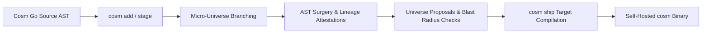

# Cosm (`cosm`) & Topocosm (`topocosm.dev`)

> **AI-Native Polyglot AST Source Control Management (SCM) & Target Compilation System**

Cosm is an AST-level Source Control Management system and target compiler written in pure Go (`go 1.22+`). Instead of tracking lines of text with unstructured string diffs, Cosm parses source code into an immutable, content-addressed AST Merkle-DAG, models parallel branching as zero-copy micro-universes, enforces cross-boundary contracts, and compiles directly into verified target environments.

---

## 🌟 Key Architecture & Capabilities

1. **AST Merkle-DAG Storage**: Code is stored as content-addressed AST symbol nodes in `.cosm/objects/` with semantic dependency edges, universe heads, and event Oplogs managed via pure-Go SQLite WAL mode (`.cosm/graph.db`).
2. **Zero-Copy Micro-Universes**: Parallel branching creates instantaneous micro-universes with non-linear frontier heads, allowing concurrent human and AI agent exploration without workspace pollution.
3. **Multi-Tier Causal Pedigree**: Cryptographic Ed25519 attestations track causality end-to-end:
   $$\text{User Prompt} \longrightarrow \text{Session ID} \longrightarrow \text{Agent ID} \longrightarrow \text{Model Parameters} \longrightarrow \text{AST Symbol Node}$$
4. **Cross-Domain Topology & Blast Radius**: Real-time dependency mapping linking Frontend components, Backend handlers, Data schemas, and Cloud Infrastructure (HCL/Terraform).
5. **Target Compilation Sidecar (`cosm ship`)**: Projects AST states into target staging sandboxes with automated build validation.
6. **Local Git Shim & CRDT Distributed Collaboration**: Operates 100% offline with zero cloud dependencies; provides a local Git plumbing shim (`cosm git`) alongside Radicle-inspired CRDT Collaborative Objects (COBs).
7. **Universe Proposals (Human PR Model)**: Proposal cards display semantic symbol deltas, topology changes, and verification badges while preserving human review workflows.

---

## 🔄 Self-Hosting Roadmap: Cosm on Cosm

Cosm is designed to achieve self-hosting dogfooding: **maintaining Cosm using Cosm itself**.



- **Phase 1: Git Shim Bootstrapping**: Git-compatible plumbing allows standard IDEs and git tools to interact seamlessly with the Cosm repository.
- **Phase 2: Polyglot Codec Dogfooding**: Cosm parses its own Go AST, configuration files, and schema models into the Merkle-DAG store.
- **Phase 3: Autonomous Agent Swarms**: Parallel agents operate in isolated micro-universes, generating AST mutations with verified cryptographic lineage.
- **Phase 4: Full Native Self-Hosting**: All code versioning, reviews, merges, and target compilations for Cosm are managed natively via `cosm`.

---

## 📦 Installation

Cosm requires **Go 1.22+** and has zero CGO dependencies.

### Option 1: Direct Go Install (Recommended)
Install the `cosm` binary directly into `$GOPATH/bin` (or `~/go/bin`):
```bash
go install github.com/cosmscm/cosm/cmd/cosm@latest
```
*Ensure `$(go env GOPATH)/bin` or `~/go/bin` is in your `$PATH`.*

### Option 2: Build from Source
```bash
git clone https://github.com/cosmscm/cosm.git
cd cosm
go build -o cosm ./cmd/cosm
sudo mv cosm /usr/local/bin/

# Optional: Build autonomous agent test harness
go build -o cosm-agent-harness ./cmd/cosm-agent-harness
sudo mv cosm-agent-harness /usr/local/bin/
```

### Option 3: VS Code & Google Antigravity Extension (`cosm-vscode`)
To compile and install the official AST-native extension from the repository:

```bash
# 1. Compile the Cosm core binary (required by extension)
go build -o cosm ./cmd/cosm
sudo cp cosm /usr/local/bin/

# 2. Compile and package the extension VSIX
cd editors/vscode
npm install && npm run compile
npx @vscode/vsce package

# 3. Install into your IDE
code --install-extension cosm-vscode-0.1.0.vsix          # VS Code
antigravity --install-extension cosm-vscode-0.1.0.vsix   # Antigravity IDE
cursor --install-extension cosm-vscode-0.1.0.vsix        # Cursor
```
*(For live dev symlink mode, see [editors/vscode/README.md](editors/vscode/README.md) and [IDE Quickstart Guide](docs/guides/ide-quickstart-for-developers.md)).*

### Verify Installation
```bash
cosm --help
cosm version
```

---

## 🚀 Quickstart

### 1. Initialize a Repository
```bash
# Initialize a new Cosm repository with a default universe
cosm init -u universe-main
```

### 2. Stage Polyglot Code into AST Symbol Nodes
```bash
# Stage Go, TypeScript, Python, HCL, or SQL source files
cosm add -p "Initial setup" -i "Staged Go backend and HCL infra" server.go infra/main.tf
```

### 3. Commit with Causal Lineage
```bash
cosm commit -i "Initial backend & infrastructure setup"
```

### 4. Inspect Workspace Status & Cross-Domain Topology
```bash
# Check staged symbol nodes and frontier heads
cosm status

# Visualize cross-boundary dependency graph (Frontend -> Backend -> Infra)
cosm topology
```

### 5. Zero-Copy Micro-Universes & Proposals
```bash
# Create an isolated micro-universe branched from universe-main
cosm universe create universe-feature-auth -p universe-main

# View AST symbol differences across universes
cosm universe diff universe-main universe-feature-auth

# Create a Universe Proposal (PR equivalent)
cosm proposal create --title "Add OAuth2 Flow" --source universe-feature-auth --target universe-main

# View proposal cards with semantic deltas
cosm proposal view prop-1
```

### 6. Compile & Ship to Target Preview
```bash
cosm ship --target local-preview
```

### 7. Interactive Terminal Dashboard
```bash
cosm dashboard
```

### 8. Try the Customer Zero Example (Camping App)

When cloning Cosm from Git, the repository includes the full-stack polyglot **Alpine Escapes Camping App** (`examples/camping_app`). Because `.cosm/` is gitignored, compile the source files into Cosm's AST Merkle-DAG to start:

```bash
cd examples/camping_app

# Compile into Cosm AST Merkle-DAG (or run ./compile_into_cosm.sh)
cosm init --universe universe-main
cosm add .
cosm commit -u universe-main -i "Compile camping app into cosm"

# Verify active universe and clean working tree lens
cosm status

# Compile ephemeral preview sandbox and run
cosm ship
go run ./cmd/server
```
Navigate to `http://localhost:8080` to experience the app! (See [`examples/camping_app/README.md`](examples/camping_app/README.md) for full walkthrough).

---

## 🤖 AI Agent Integration & Antigravity Skills

Cosm is designed natively for pair-programming agents (such as Antigravity / Gemini) and autonomous swarms. To ensure agents interact with Cosm via AST-level surgery rather than error-prone text/line diffs, specialized skills are bundled in [`.agents/skills/`](.agents/skills).

### Bundled Skills Catalog

| Skill Name | Location | Description & Capabilities |
| :--- | :--- | :--- |
| **`cosm-core-dev`** | [`.agents/skills/cosm-core-dev/SKILL.md`](.agents/skills/cosm-core-dev/SKILL.md) | Initializing repositories, WAL graph operations (`.cosm/graph.db`), zero-copy micro-universes, and CLI workflows. |
| **`cosm-ast-surgeon`** | [`.agents/skills/cosm-ast-surgeon/SKILL.md`](.agents/skills/cosm-ast-surgeon/SKILL.md) | Executing declarative AST code modifications using 9 geometric verbs (`insert_symbol`, `replace_body`, `delete_symbol`, etc.) without full-file rewrites. |
| **`shipping-and-validation`** | [`.agents/skills/shipping-and-validation/SKILL.md`](.agents/skills/shipping-and-validation/SKILL.md) | Running target compilation previews (`cosm ship`), Terraform validation, Python `uv` tests, and containerless staging. |
| **`polyglot-codecs-guide`** | [`.agents/skills/polyglot-codecs-guide/SKILL.md`](.agents/skills/polyglot-codecs-guide/SKILL.md) | Implementing and testing AST parsers and cross-boundary contract inferencers across 19 supported languages. |
| **`cosm-agent-harness`** | [`.agents/skills/cosm-agent-harness/SKILL.md`](.agents/skills/cosm-agent-harness/SKILL.md) | Benchmarking autonomous agent execution, scoring verification oracles (0–100), and running scenario suites. |

### How Antigravity Loads and Executes Skills

Antigravity uses a **hierarchical discovery** and **progressive disclosure** model:

```
[Repository Root]
  └── .agents/skills/<skill-name>/SKILL.md
        │
        ├── 1. Discovery & Indexing ──► Agent startup reads YAML frontmatter (name & description)
        │                               into system prompt (<skills> block). Zero token overhead.
        │
        └── 2. Progressive Activation ──► When a prompt matches a skill (e.g. AST surgery, shipping),
                                        the agent calls view_file on SKILL.md to load full procedures.
```

1. **Discovery**: Antigravity automatically scans for `.agents/skills/*/SKILL.md` from the current working directory up to the workspace root.
2. **Progressive Disclosure**: At startup, only the YAML frontmatter (`name` and `description`) is injected into the context window. Full runbooks are read on-demand only when the agent needs them, keeping the context window focused.
3. **Project Invariants**: In addition to skills, Antigravity loads [`AGENTS.md`](AGENTS.md) and [`GEMINI.md`](GEMINI.md) unconditionally to enforce hard architectural rules (pure Go, zero-CGO WAL, offline local engine, and test toolchains).

### Using Cosm Skills in Any Project (Outside the Cosm Repo)

To empower Antigravity or any agent to use Cosm in other repositories:

* **Workspace Scope** (recommended for team projects):
  ```bash
  mkdir -p .agents/skills
  cp -r /path/to/cosm/.agents/skills/cosm-* .agents/skills/
  ```
* **Global Machine Scope** (applies across all local projects):
  ```bash
  mkdir -p ~/.gemini/config/skills
  cp -r /path/to/cosm/.agents/skills/cosm-ast-surgeon ~/.gemini/config/skills/
  cp -r /path/to/cosm/.agents/skills/cosm-core-dev ~/.gemini/config/skills/
  ```

---

## 📁 Repository Structure

```
cosm/
├── cmd/
│   ├── cosm/                   # Developer CLI binary (`cosm`)
│   └── cosm-agent-harness/     # Standalone autonomous test & rater agent harness
├── pkg/
│   ├── api/                    # gRPC & in-process client/server SDK
│   ├── codecs/                 # Polyglot AST parsers (Go, TS, Python, HCL, Rust, Java, C++, Swift, Kotlin, C#, WASM, Zig, GraphQL, Ruby, PHP, Elixir, SQL, Proto, Dockerfile)
│   ├── collaboration/          # Conflict engine & multi-universe fitness evaluator
│   ├── core/                   # Core schemas, Merkle hasher, and graph linker
│   ├── distributed/            # Radicle-inspired CRDT COBs & P2P sync
│   ├── gitshim/                # Git command interceptor & synthetic tree generator
│   ├── lineage/                # Ancestry tracer, audit engine, & Ed25519 attestations
│   ├── materialize/            # AST-to-source hydrators, terminal viewer, & VFS
│   ├── mutation/               # AST symbol surgery & cross-boundary blast radius
│   ├── onboarding/             # Snapshot & historical Git repo ingestion pipelines
│   ├── review/                 # AST proposal cards, human annotations, & AI critic protocols
│   ├── shipping/               # Target specification, staging engine, & compilers
│   ├── storage/                # Blobstore, SQLite WAL graph engine, & vector index
│   ├── target/                 # Target environment projector & local preview sandbox
│   ├── topocosm/               # Topocosm Hub daemon, swarm simulator, & sparse replication
│   └── tui/                    # Bubble Tea interactive terminal dashboard
├── docs/                       # Architecture specs, guides, and reference manuals
├── examples/                   # Polyglot demo workspaces (Terraform + Go + React)
└── test/
    └── agents/                 # Autonomous agent test suites, LLM harness, & rater oracles
```

---

## 🧪 Testing & Validation Guides

For testing Cosm and Topocosm, refer to the 3 step-by-step testing guides:

1. **[Guide 1: IDE Setup & Polyglot AST Core Workflow](docs/guides/testing-guide-ide-and-core.md)**
   * Setting up IDEs (VS Code, Cursor, JetBrains, Zed, Neovim) with Cosm
   * Workspace initialization (`cosm init`)
   * Polyglot AST symbol parsing and staging (`cosm add`)
   * Multi-domain dependency topology visualization (`cosm topology`)
   * Ephemeral preview compilation and shipping (`cosm ship`)

2. **[Guide 2: Micro-Universes, AST Surgery & Universe Proposals](docs/guides/testing-guide-universes-and-proposals.md)**
   * Instant zero-copy micro-universe branching (`cosm universe create`)
   * AST-level symbol diffing (`cosm universe diff`)
   * Human-understandable Universe Proposal review cards (`cosm proposal view`)
   * CRDT-based universe merging (`cosm universe merge`)
   * Interactive Bubble Tea TUI dashboard (`cosm dashboard`)

3. **[Guide 3: Topocosm Hub, Multi-Agent Swarms & Sparse Replication](docs/guides/testing-guide-topocosm-and-swarms.md)**
   * Running the zero-Docker Topocosm Hub daemon (`cosm topocosm dev`)
   * Machine-first agent discovery manifest (`/.well-known/cosm-agent.json`)
   * Multi-agent concurrent swarm simulation benchmark (`cosm topocosm test-swarm`)
   * Publishing workspaces and sparse AST subgraph cloning (`cosm clone --sparse`)

---

## 📚 Complete Documentation Index

| Guide | Description |
| :--- | :--- |
| [What is Cosm?](docs/what-is-cosm.md) | Architectural philosophy, problem space, and comparative analysis |
| [5-Minute Quickstart](docs/getting-started.md) | Rapid onboarding and initial setup guide |
| [Micro-Universes & Parallel Swarms](docs/guides/micro-universes.md) | Non-linear branching and zero-copy micro-universes |
| [AI-Native Proposals & Code Review](docs/guides/proposals-and-reviews.md) | Universe Proposals, human annotations, and AI critic checks |
| [Target Shipping & Ephemeral Previews](docs/guides/target-shipping.md) | Isolated compilation targets and preview sidecar |
| [Surgical AST Mutations & Lineage](docs/guides/ast-mutations-and-lineage.md) | 9 Geometric AST verbs and causal pedigree tracing |
| [Git Interoperability & Remote Sync](docs/guides/git-interop.md) | Local Git plumbing shim and Radicle-style CRDT COBs |
| [CLI Reference Manual](docs/reference/cli.md) | Complete flag, subcommand, and argument specifications |
| [Agent API & SDK Reference](docs/reference/agent-api.md) | In-process and gRPC SDK for autonomous agents |
| [Schema & Durable Storage Spec](docs/reference/schema-and-storage.md) | Content-addressed blobstore and SQLite WAL schema |
| [Language Codecs & Contract Inference](docs/reference/codecs.md) | Polyglot parser implementations and symbol boundary contracts |
| [Language Codec & Binary Asset Specification](docs/reference/language-and-binary-requirements.md) | Architectural specification for Storage, Presentation, and Compilation across 19 languages |
| [Topocosm Hub & Agent Distribution](docs/reference/topocosm.md) | Machine discovery manifests, sparse cloning, and hub federation |
| [PR & Collaboration Workflow](docs/HOW_TO_PR_AND_COLLABORATION.md) | Human reviewer and agent collaboration protocol |

---

## 🛠️ Testing & Verification

Run the test suite:
```bash
# Run all Go package unit and integration tests
go test -v ./pkg/...

# Run autonomous agent harness hermetic tests
go test -v ./test/agents/...
```

---

## 📄 License

Licensed under the Apache License, Version 2.0. See LICENSE for details.
