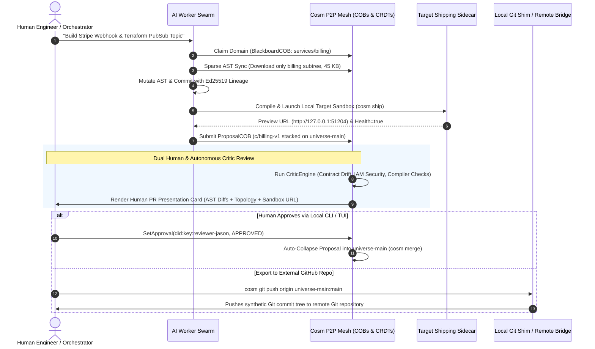

# Cosm (`cosm`): Pull Requests, Universe Proposals & Distributed Collaboration Guide

This document defines how **Pull Requests (PRs)** and their AI-native equivalent—**Universe Proposals**—work in `cosm`, including **human-understandable code review cards**, **Jujutsu-style stacked proposals**, **Radicle-inspired P2P Collaborative Objects (COBs)**, and **Git interoperability**.

---

## 1. Concept: Human-Understandable PRs on an AST SCM

Cosm does **not** abandon the human-understandable concept of a Pull Request (PR). Instead, Cosm **elevates** the PR model to be more expressive, verifiable, and resilient.

| PR Capability | Traditional Git / GitHub PR | `cosm` Universe Proposal (Elevated PR) |
| :--- | :--- | :--- |
| **Discrete Proposed Unit** | Branch comparison with Title & Description | First-class Proposal COB with stable `ChangeID` |
| **Code Representations** | Line-by-line unified text diff (`+` / `-`) | **Dual View**: Unified text diff + syntax-highlighted AST Symbol Cards |
| **Contract & Architecture** | None (hidden inside diff lines) | Visual Cross-Domain Topology Graph (`CONSUMES_API`, `DEPLOYS_TO`, `BINDS_ENV`) |
| **Provenance Pedigree** | Unverified author string & commit message | Cryptographic Ed25519 in-toto envelope ($\text{Prompt} \rightarrow \text{Session} \rightarrow \text{Agent} \rightarrow \text{Model}$) |
| **Review & Critique** | Human line comments | **Dual Review**: Human comments + Autonomous AI Critic multi-vector scoring |
| **Live Target Verification** | External CI build (minutes later) | Sub-second local Preview Sandbox URL (`cosm ship`) with compiler diagnostics |
| **Stacked PR Evolution** | Manual rebase hell when parent PR changes | Automatic AST Evolution (`cosm stack evolve`) with zero rebase collisions |

---

## 2. Distributed Architecture: Radicle-Inspired P2P Swarms & COBs

Traditional centralized hosts (like GitHub) force 50+ concurrent agents through a single bottleneck, leading to massive download egress, central ref locks, and rebase storms. Cosm adopts a **Radicle-inspired distributed P2P architecture**:



---

## 3. Developer Workflow Guide

### Guide 3.1: Creating and Proposing a Change (PR)

1. **Fork a Micro-Universe**:
   ```bash
   ./cosm init -u universe-main
   ./cosm universe create u/feature-billing -p universe-main
   ```

2. **Stage and Parse Files into AST**:
   ```bash
   ./cosm add -u u/feature-billing \
       -a "dev-jason" \
       -p "Implement Stripe billing webhook and cloud pubsub subscription" \
       -i "Add billing webhook handler and terraform pubsub topic" \
       services/billing/main.go \
       infra/pubsub.tf \
       web/src/BillingSettings.tsx
   ```

3. **Verify Target Compilation & Live Preview Sandbox**:
   ```bash
   ./cosm ship -u u/feature-billing
   # Output:
   # 🚀 Shipping Sidecar Execution Succeeded!
   #    Package Size: 2410 bytes
   #    Preview URL:  http://127.0.0.1:51204
   #    Health:       true
   ```

4. **Open a Proposal (PR)**:
   ```bash
   ./cosm proposal create \
       --source u/feature-billing \
       --target universe-main \
       --title "Feature: Stripe Billing Webhook & PubSub"
   ```

---

### Guide 3.2: Human Review & Code Inspection

1. **View Rich Human-Understandable PR Presentation**:
   ```bash
   ./cosm proposal view --source u/feature-billing --format terminal
   # Or export full Markdown for Web/IDE preview:
   ./cosm proposal view --source u/feature-billing --format markdown
   ```

2. **Run Autonomous AI Critic Review**:
   ```bash
   ./cosm proposal review --source u/feature-billing --critic critic-agent-core
   ```

3. **Inspect Architecture Topology**:
   ```bash
   ./cosm topology -u u/feature-billing
   ```

4. **Merge the Proposal**:
   ```bash
   ./cosm proposal merge --source u/feature-billing --target universe-main
   ```

---

## 4. Jujutsu-Style Stacked Proposals & History Evolution (`cosm stack`)

Large features are easiest to review when broken into small, discrete, stacked changes (e.g., Data Model $\rightarrow$ API Route $\rightarrow$ Frontend UI $\rightarrow$ Cloud Infra).

### 4.1. Registering a Stack of Dependent Changes

```bash
# 1. Base data model change
./cosm stack create -c c/auth-model -u u/auth-model -p universe-main --title "Step 1: Auth Model"

# 2. Dependent API route change (parent is c/auth-model)
./cosm stack create -c c/auth-api -u u/auth-api -p c/auth-model --title "Step 2: Auth Route API"

# 3. Dependent React UI change (parent is c/auth-api)
./cosm stack create -c c/auth-ui -u u/auth-ui -p c/auth-api --title "Step 3: Auth React UI"
```

Inspect active stacks:
```bash
./cosm stack list
# Output:
# 🥞 Jujutsu-Style Stacked Proposals & Change Chains:
#    [1] 🔹 c/auth-model         (Universe: u/auth-model, Head: a93b1e84)
#        Parent: universe-main | Auto-Rebase: Active
#    [2] 🔹 c/auth-api           (Universe: u/auth-api, Head: c4109fa2)
#        Parent: c/auth-model | Auto-Rebase: Active
#    [3] 🔹 c/auth-ui            (Universe: u/auth-ui, Head: e82b7190)
#        Parent: c/auth-api | Auto-Rebase: Active
```

---

### 4.2. How-To: Rebasing Stacked Changes (`cosm stack evolve`)

In traditional Git, modifying a base branch or parent commit breaks all downstream branches, triggering manual interactive rebases (`git rebase --onto`) and textual conflict cascades.

Cosm solves this with **AST-level CRDT auto-evolution**:
```bash
# Execute evolution rebase across all downstream dependents of c/auth-model
./cosm stack evolve -c c/auth-model
```

**What Cosm Executes**:
1. Locates all descendant stacked changes (`c/auth-api`, `c/auth-ui`) ordered by stack topological depth.
2. For each descendant, fetches its AST delta ($\Delta_{\text{AST}}$) and computes the semilattice union join with the updated parent manifest root:
   $$H_C' = \text{MerkleRoot}(H_P' \sqcup \Delta_{\text{AST}}(C))$$
3. Advances each child's manifest pointer to the new Merkle root with zero text merge collisions.

**Output**:
```
⚡ Auto-evolved 2 descendant changes in stack:
   ✓ Rebased c/auth-api onto new parent AST root without conflict
   ✓ Rebased c/auth-ui onto new parent AST root without conflict
```

---

### 4.3. How-To: Fixing History & Amending Code Mistakes

Traditional Git requires destructive history rewriting (`git commit --amend`, `git rebase -i` squash/edit/drop, or `git reset`). Cosm preserves cryptographically signed causal lineage envelopes while providing three non-destructive mechanisms to fix code or correct history:

#### Method 1: Surgical In-Place AST Repair (Replaces `git commit --amend`)
Instead of rewriting commit logs, modify the exact AST symbol node directly in the active micro-universe:
```bash
# Surgically replace a function body in-place (updates AST DAG and workspace file)
cosm ast edit \
  --op replace_function_body \
  --target "services/auth::ValidateToken" \
  --content "return token.Valid && !token.Expired()" \
  -u universe-main -w

# Commit the surgical correction with lineage provenance
cosm commit -u universe-main -i "Fix token expiration boundary check" -p "Correct JWT expiry validation"
```
* **Advantage**: Untouched symbols retain identical content-addressed hashes. Downstream contracts remain intact without invalidating the Merkle-DAG ancestry.

#### Method 2: Non-Destructive Micro-Universe Branch & Merge (Replaces `git reset` / cherry-pick)
If an agent or developer introduced unwanted mutations or needs to pivot without corrupting `universe-main`:
```bash
# 1. Fork an isolated micro-universe from known good parent
cosm universe create u/hotfix-auth -p universe-main

# 2. Stage only desired changes
cosm add services/auth/jwt.go -u u/hotfix-auth -i "Apply correct token parsing"

# 3. Validate compilation and test suites via shipping sidecar
cosm ship -u u/hotfix-auth -t target:cosm

# 4. Collapse and merge cleanly into main universe
cosm universe merge u/hotfix-auth -t universe-main -s union
```

#### Method 3: First-Class Conflict Reification (Non-Blocking Divergence)
When concurrent agents mutate intersecting contracts, Cosm does not halt pipelines or drop commits. Discrepancies are reified as first-class `ASTConflictNode`s in the Merkle-DAG:
* Inspect unresolved conflicts via `cosm status`.
* Resolve by running `cosm ast edit` on the conflicting symbol node, then commit the resolution.

---

## 5. Decentralized P2P & Sparse Replication (`cosm peer`)

When running parallel agent swarms across multiple processes or distributed machines:

1. **Check Swarm & Seed Node Mesh Status**:
   ```bash
   ./cosm peer status
   ```

2. **Sparse AST Replication (Bandwidth-Optimized Sync)**:
   Instead of cloning a 250 MB repository, an agent synchronizes only the specific component and its contract edges:
   ```bash
   ./cosm peer sync -u universe-main --sparse "services/billing"
   # Output:
   # 📡 Sparse AST Replication for Universe 'universe-main':
   #    • Filter:           services/billing
   #    • Synchronized:     12 AST blobs (1 components, 11 symbols)
   #    • Bandwidth Saved:  94.2% reduction vs full repository clone (12 blobs synced vs 207 total blobs)
   # ✨ Local state synchronized with peer swarm.
   ```

---

## 6. Git Interoperability & Remote Git Compatibility

When collaborating with external teams or CI systems that use standard Git:
- **`cosm git status/diff/log`**: Queries virtual AST trees locally without disk overhead.
- **`cosm git push <remote> <universe>:<branch>`**: Synthesizes standard Git commit trees on-the-fly and pushes to any Git server (GitHub, GitLab, self-hosted Git).
