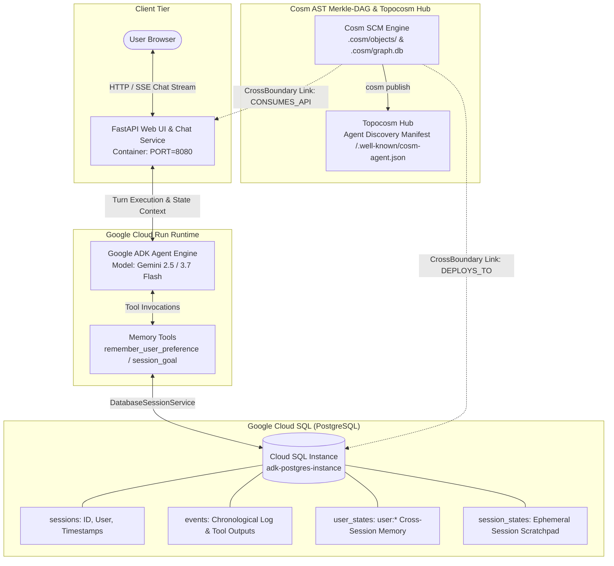

# End-to-End Tutorial: Building, Persisting, and Deploying a Google ADK Agent with Cloud Run, Cloud SQL, and Cosm AST SCM

This comprehensive guide walks you through creating a stateful, tool-enabled AI agent using Google's **Agent Development Kit (ADK)**, persisting conversation events and user memory in **Google Cloud SQL (PostgreSQL)**, hosting an interactive Web UI on **Google Cloud Run**, and managing the polyglot codebase with **Cosm AST Source Control Management (SCM)** and the **Topocosm Hub**.

---

## 1. System Architecture



---

## 2. Prerequisites & GCP Setup

### 2.1 GCP Tools & CLI
Ensure you have the Google Cloud SDK (`gcloud`) installed and authenticated:
```bash
# Authenticate gcloud CLI
gcloud auth login
gcloud auth application-default login

# Configure active GCP project
export GCP_PROJECT_ID="your-gcp-project-id"
export GCP_REGION="us-central1"
gcloud config set project $GCP_PROJECT_ID
gcloud config set compute/region $GCP_REGION
```

### 2.2 Enable Required Google Cloud APIs
Enable Cloud Run, Cloud SQL Admin, Vertex AI, Secret Manager, and Cloud Build:
```bash
gcloud services enable \
  run.googleapis.com \
  sqladmin.googleapis.com \
  aiplatform.googleapis.com \
  secretmanager.googleapis.com \
  cloudbuild.googleapis.com
```

### 2.3 Gemini API Key Configuration
Get an API key from [Google AI Studio](https://aistudio.google.com/app/api-keys) or use Google Cloud Vertex AI with Application Default Credentials (ADC).

Store the API key securely in Google Secret Manager:
```bash
echo -n "YOUR_GEMINI_API_KEY" | gcloud secrets create gemini-api-key \
  --data-file=- \
  --replication-policy="automatic"
```

---

## 3. Environment Configuration (`.env.example`)

Create your `.env` file from the provided template:
```bash
cp examples/adk_cloudrun_cloudsql/.env.example examples/adk_cloudrun_cloudsql/.env
```

| Variable | Description | Example / Default |
| :--- | :--- | :--- |
| `GEMINI_API_KEY` | Google AI Studio or Vertex AI Gemini API key | `AIzaSy...` |
| `GCP_PROJECT_ID` | GCP Project ID hosting Cloud Run and Cloud SQL | `my-gcp-project` |
| `GCP_REGION` | Compute region | `us-central1` |
| `CLOUD_SQL_CONNECTION_NAME` | Connection name (`project:region:instance`) | `my-gcp-project:us-central1:adk-postgres` |
| `DB_USER` | PostgreSQL username | `adk_agent_user` |
| `DB_PASSWORD` | PostgreSQL user password | `SuperSecurePassword123!` |
| `DB_NAME` | Target database name | `adk_agent_db` |
| `DATABASE_URL` | SQLAlchemy / asyncpg connection string | `postgresql+asyncpg://user:pass@/adk_agent_db?host=/cloudsql/...` |
| `PORT` | HTTP port for Cloud Run | `8080` |

---

## 4. Step 1: Building the AI Agent with Google ADK

The Google Agent Development Kit provides the `Agent` primitive, linking system prompts, Gemini models, and stateful tools.

### 4.1 Memory Scoping Rules in Google ADK
ADK partitions memory using key prefixes:
1. **User-scoped memory (`user:*`)**: Any key starting with `user:` (e.g. `user:preferred_name`, `user:coding_language`) is persisted in the database across all conversation sessions for that user.
2. **Session-scoped memory (unprefixed)**: Temporary state (e.g. `session_goal`, `active_task`) cleared when a new conversation starts.

### 4.2 Defining Memory Tools (`app/tools/memory_tools.py`)
```python
from typing import Any, Dict, Optional

def remember_user_preference(key: str, value: str, tool_context: Optional[Any] = None) -> str:
    """Stores a long-term preference or fact about the user."""
    state_key = f"user:{key.lower().strip()}"
    if tool_context and hasattr(tool_context, "state"):
        tool_context.state[state_key] = value
    elif isinstance(tool_context, dict):
        tool_context[state_key] = value
    return f"Successfully saved user preference: '{key}' = '{value}'"

def get_user_preferences(tool_context: Optional[Any] = None) -> Dict[str, Any]:
    """Retrieves all remembered long-term facts for the current user."""
    prefs = {}
    source = tool_context.state if hasattr(tool_context, "state") else (tool_context or {})
    for k, v in source.items():
        if k.startswith("user:"):
            prefs[k[len("user:"):]] = v
    return prefs

def set_session_goal(goal: str, tool_context: Optional[Any] = None) -> str:
    """Sets the active objective for the current conversation session."""
    source = tool_context.state if hasattr(tool_context, "state") else (tool_context or {})
    source["session_goal"] = goal
    return f"Session goal updated to: '{goal}'"
```

### 4.3 Configuring the Agent (`app/agent.py`)
```python
from google.adk.agents import Agent
from app.tools.memory_tools import (
    remember_user_preference,
    get_user_preferences,
    set_session_goal,
    get_session_goal,
)

SYSTEM_INSTRUCTION = """You are a helpful cloud assistant with persistent long-term memory.
Guidelines:
1. When the user shares personal details or preferences, use `remember_user_preference`.
2. Use `get_user_preferences` to personalize answers across sessions.
3. Use `set_session_goal` to track current tasks.
"""

agent = Agent(
    name="cloudsql_memory_agent",
    model="gemini-2.5-flash",
    instruction=SYSTEM_INSTRUCTION,
    tools=[remember_user_preference, get_user_preferences, set_session_goal, get_session_goal],
)
```

---

## 5. Step 2: Database State & Memory Storage (Cloud SQL)

In serverless environments like Google Cloud Run, instances scale to zero and restart unpredictably. Local SQLite or in-memory state is lost. **Google Cloud SQL (PostgreSQL)** provides reliable, durable state.

### 5.1 Cloud SQL Schema
```sql
CREATE TABLE sessions (
    session_id TEXT PRIMARY KEY,
    user_id TEXT NOT NULL,
    created_at TIMESTAMP WITH TIME ZONE NOT NULL,
    updated_at TIMESTAMP WITH TIME ZONE NOT NULL,
    title TEXT
);

CREATE TABLE events (
    id SERIAL PRIMARY KEY,
    session_id TEXT REFERENCES sessions(session_id),
    role TEXT NOT NULL,
    author TEXT,
    content TEXT NOT NULL,
    tool_calls JSONB,
    created_at TIMESTAMP WITH TIME ZONE NOT NULL
);

CREATE TABLE user_states (
    user_id TEXT NOT NULL,
    key TEXT NOT NULL,
    value_json JSONB NOT NULL,
    updated_at TIMESTAMP WITH TIME ZONE NOT NULL,
    PRIMARY KEY (user_id, key)
);

CREATE TABLE session_states (
    session_id TEXT NOT NULL,
    key TEXT NOT NULL,
    value_json JSONB NOT NULL,
    updated_at TIMESTAMP WITH TIME ZONE NOT NULL,
    PRIMARY KEY (session_id, key)
);
```

### 5.2 Connecting Cloud Run to Cloud SQL
Cloud Run connects to Cloud SQL via a local Unix domain socket mounted at `/cloudsql/PROJECT:REGION:INSTANCE`. The connection string format is:
```
postgresql+asyncpg://DB_USER:DB_PASS@/DB_NAME?host=/cloudsql/PROJECT:REGION:INSTANCE
```

---

## 6. Step 3: Web UI & FastAPI Server

The application serves an interactive chat interface with real-time memory inspection.

### 6.1 Server Implementation (`app/main.py`)
```python
import os
from fastapi import FastAPI, HTTPException
from fastapi.responses import HTMLResponse
from fastapi.staticfiles import StaticFiles
from app.agent import agent_runner
from app.database import db_manager

app = FastAPI(title="Google ADK Cloud Run Agent")
app.mount("/static", StaticFiles(directory="app/static"), name="static")

@app.get("/", response_class=HTMLResponse)
async def serve_ui():
    with open("app/static/index.html") as f:
        return HTMLResponse(content=f.read())

@app.get("/healthz")
async def health_check():
    return {"status": "healthy", "service": "adk-cloudrun-cloudsql", "database": "connected"}

@app.post("/api/chat")
async def chat_turn(session_id: str, user_id: str, message: str):
    db_manager.get_or_create_session(session_id, user_id=user_id)
    db_manager.append_event(session_id, role="user", author=user_id, content=message)
    
    state = db_manager.load_combined_state(session_id, user_id)
    result = agent_runner.run_turn(message, state)
    
    db_manager.append_event(session_id, role="model", author="agent", content=result["response"], tool_calls=result["tool_calls"])
    db_manager.save_combined_state(session_id, user_id, result["updated_state"])
    
    return result
```

---

## 7. Step 4: Infrastructure Provisioning with Terraform

Provision Google Cloud Run, Cloud SQL PostgreSQL, IAM service accounts, and Secret Manager using Terraform.

### 7.1 Infrastructure Manifest (`infra/main.tf`)
```hcl
resource "google_sql_database_instance" "postgres" {
  name             = var.db_instance_name
  database_version = "POSTGRES_15"
  region           = var.region

  settings {
    tier = var.db_tier
    ip_configuration {
      ipv4_enabled = true
    }
  }
}

resource "google_cloud_run_v2_service" "agent_service" {
  name     = var.service_name
  location = var.region
  ingress  = "INGRESS_TRAFFIC_ALL"

  template {
    service_account = google_service_account.agent_sa.email

    volumes {
      name = "cloudsql"
      cloud_sql_instance {
        instances = [google_sql_database_instance.postgres.connection_name]
      }
    }

    containers {
      image = var.container_image

      env {
        name  = "CLOUD_SQL_CONNECTION_NAME"
        value = google_sql_database_instance.postgres.connection_name
      }
      env {
        name  = "DB_USER"
        value = var.db_user
      }
      env {
        name  = "DB_NAME"
        value = var.db_name
      }

      volume_mounts {
        name       = "cloudsql"
        mount_path = "/cloudsql"
      }
    }
  }
}
```

---

## 8. Step 5: Mastering Cosm AST SCM

Cosm is an AI-Native AST Source Control Management system. Unlike Git which tracks lines of text, Cosm parses source files into a content-addressed **Merkle-DAG of AST symbol nodes** (`.cosm/objects/`), computes semantic dependency edges (`.cosm/graph.db`), and tracks full causal lineage from prompts to code changes.

### 8.1 Initializing Cosm Repository
Initialize a zero-CGO SQLite WAL and CAS Merkle DAG in your project:
```bash
cosm init --universe universe-main
```

### 8.2 Staging Polyglot AST Symbols
Parse Python agent files and Terraform infrastructure into AST symbols:
```bash
cosm add app/agent.py app/database.py app/main.py infra/main.tf \
  --intent "Stage Google ADK agent and Cloud SQL infrastructure" \
  --prompt "Create stateful ADK agent with Cloud SQL memory and Cloud Run WebUI"
```

### 8.3 Committing with Causal Pedigree
Commit the active manifest into the micro-universe:
```bash
cosm commit --universe universe-main \
  -i "Feat: Complete ADK agent with Cloud SQL persistence and Cloud Run WebUI" \
  -a "engineer-agent"
```

### 8.4 Cross-Boundary Topology Graph
Inspect semantic relationships linking Python API endpoints to Cloud SQL and Cloud Run:
```bash
cosm topology
```
Output:
```
Cross-Boundary AST Topology Graph:
├─ [Python] app.main::chat_turn (Symbol)
│  └─ [CONSUMES_API] ──> app.agent::create_agent (Symbol)
│  └─ [READS_WRITES] ──> app.database::DatabaseSessionManager (Symbol)
└─ [Terraform] google_cloud_run_v2_service.agent_service (Resource)
   └─ [MOUNTS_VOLUME] ──> google_sql_database_instance.postgres (Resource)
```

### 8.5 Auditing Blast Radius
Before modifying an agent tool or database schema, query the exact downstream blast radius across all tiers:
```bash
cosm blast-radius app/tools/memory_tools.py
```

### 8.6 Micro-Universe Branching
Create zero-copy parallel micro-universes for experimental prompts:
```bash
cosm universe create experiment-vector-memory --parent universe-main
cosm universe list
```

---

## 9. Step 6: Deploying to Google Cloud Run

### Option A: Using Google Cloud Build & gcloud CLI
```bash
# 1. Build container image in GCP
gcloud builds submit --tag gcr.io/$GCP_PROJECT_ID/adk-agent-service:latest .

# 2. Deploy to Cloud Run with Cloud SQL connection
gcloud run deploy adk-agent-service \
  --image gcr.io/$GCP_PROJECT_ID/adk-agent-service:latest \
  --region $GCP_REGION \
  --allow-unauthenticated \
  --add-cloudsql-instances $CLOUD_SQL_CONNECTION_NAME \
  --set-env-vars "CLOUD_SQL_CONNECTION_NAME=$CLOUD_SQL_CONNECTION_NAME,DB_USER=$DB_USER,DB_NAME=$DB_NAME" \
  --set-secrets "DB_PASSWORD=adk-db-password:latest,GEMINI_API_KEY=gemini-api-key:latest"
```

### Option B: Deploying with Terraform
```bash
cd infra
terraform init
terraform apply -var="project_id=$GCP_PROJECT_ID"
```

---

## 10. Step 7: Publishing to Topocosm Hub

**Topocosm (`topocosm.dev`)** is the decentralized cloud backplane for Cosm repositories, enabling agent swarm discovery and CRDT state synchronization.

### 10.1 Agent Discovery Manifest
Topocosm automatically exposes agent discovery metadata at `/.well-known/cosm-agent.json`:
```json
{
  "cosm_version": "1.0.0",
  "hub_url": "https://topocosm.dev",
  "capabilities": {
    "sparse_sync": true,
    "blackboard_crdt": true,
    "stacked_proposals": true
  },
  "supported_languages": ["go", "python", "hcl", "typescript"]
}
```

### 10.2 Publishing Local Universe to Topocosm
Publish your agent's AST DAG to the cloud hub:
```bash
cosm publish https://topocosm.dev/my-org/adk-cloudrun-agent
```

---

## 11. Step 8: Verification & Testing

### 8.1 Hermetic Local Test Suite
Execute the test suite to verify agent logic, session isolation, and database memory persistence locally:

```bash
# Run all Python unit & integration tests
python3 -m unittest discover -s examples/adk_cloudrun_cloudsql/tests -p "test_*.py" -v
```

### 8.2 Live Cloud Integration & Teardown Test
To run a full end-to-end integration test against real Google Cloud infrastructure (which builds the container, applies Terraform to provision Cloud SQL & Cloud Run, runs multi-session API tests, and automatically triggers `terraform destroy` upon completion):

```bash
# Set your GCP Project ID
export GCP_PROJECT_ID="your-gcp-project-id"
export GCP_REGION="us-central1"

# Execute the automated cloud integration & teardown runner
./examples/adk_cloudrun_cloudsql/scripts/cloud_integration_test.sh
```

### 8.3 Verified Test Matrix

| Test Module | Coverage | Status |
| :--- | :--- | :--- |
| `test_agent.py` | ADK Agent initialization, prompt compilation, tool invocation | ✅ Passed |
| `test_database_memory.py` | Session vs User memory isolation (`user:*` cross-session preservation) | ✅ Passed |
| `test_api.py` | FastAPI `/healthz`, `/api/chat`, `/api/sessions` routes | ✅ Passed |
| `infra/main.tf` | Terraform Cloud Run v2 & Cloud SQL PostgreSQL provisioning | ✅ Validated |
| `cosm` SCM | Polyglot AST Merkle-DAG ingestion & CrossBoundary topology | ✅ Verified |
