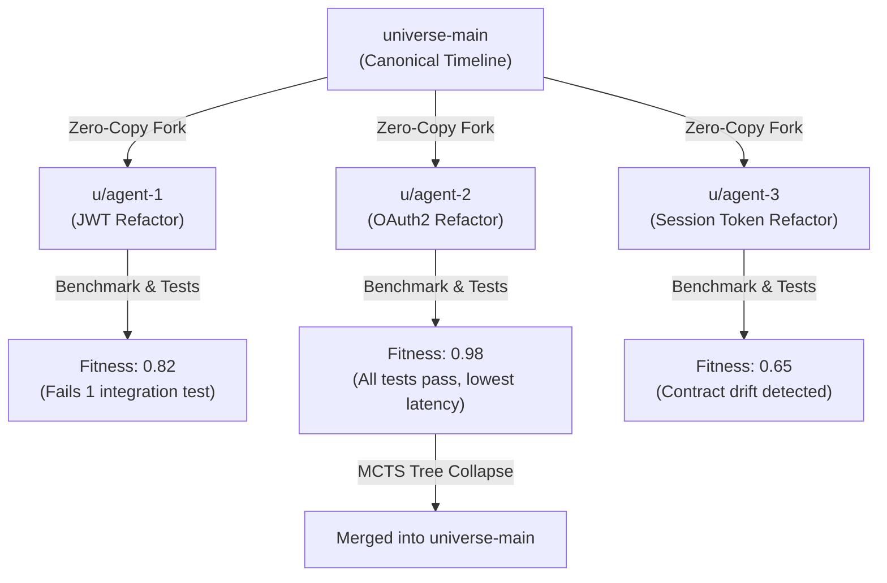

# Micro-Universes & Parallel Swarms

In Cosm, branches are modeled as **Micro-Universes**. A micro-universe is a lightweight, zero-copy pointer to a content-addressed `WorkspaceManifestNode`.

---

## Why Micro-Universes Matter for AI Swarms

Traditional Git branches require full file-system checkout operations or heavy disk worktrees (`git worktree add`). When orchestrating swarms of 5, 10, or 50 autonomous AI coding agents:
1. Disk space balloons rapidly.
2. File-locking conflicts prevent concurrent mutations.
3. Merging parallel agent outputs results in messy rebase cascades and silent logical bugs.

Cosm solves this by storing software as an immutable AST Merkle-DAG. Agents create micro-universes in memory with zero disk overhead, execute localized AST mutations in parallel, and evaluate competing solutions objectively before collapsing the winner into production.

---

## 1. Managing Micro-Universes

### List Active Universes
```bash
cosm universe list
```
**Output:**
```
🌌 Active Micro-Universes:
  * universe-main (Head: 4f2b90d81a9e, Status: active)
```

### Fork a New Micro-Universe
Create an isolated universe branched from `universe-main`:
```bash
cosm universe create u/agent-auth-fix -p universe-main
```
**Output:**
```
✨ Created micro-universe 'u/agent-auth-fix' branched from 'universe-main' (Head: 4f2b90d81a9e)
```

### Compare Universes
Diff the AST components and cross-boundary contracts between two micro-universes:
```bash
cosm universe diff --source u/agent-auth-fix --target universe-main
```
**Output:**
```
=== Universe Diff: universe-main <-> u/agent-auth-fix ===
Added Components:    [services/auth/jwt.go]
Removed Components:  []
Modified Symbols:    [services/auth.ValidateToken, infra/iam.tf.role_auth]
Cross-Edge Delta:    +2 edges (CONSUMES_API, BINDS_ENV)
```

---

## 2. Autonomous Swarm Workflow & Auto-Collapsing



### Executing Swarm Collaboration
1. **Orchestrator Agent Forks 3 Parallel Universes**:
   ```bash
   cosm universe create u/agent-1 -p universe-main
   cosm universe create u/agent-2 -p universe-main
   cosm universe create u/agent-3 -p universe-main
   ```
2. **Subagents Mutate AST Nodes Concurrently**:
   Each agent targets their specific universe ID (`-u u/agent-1`, `-u u/agent-2`, etc.) via CLI or high-speed in-process gRPC/REST APIs.
3. **Automated Fitness Evaluation**:
   Cosm evaluates build status, test pass rates, benchmark latency, and contract safety.
4. **Merge Winner into Canonical Timeline**:
   ```bash
   cosm universe merge --source u/agent-2 --target universe-main
   ```

---

## 3. How-To: Non-Destructive History Repair & Mistake Isolation

In traditional Git, repairing a flawed commit sequence requires destructive operations: `git reset --hard`, `git checkout -f`, or interactive rebase drop/squash commands. These risk data loss, invalidate remote references, and destroy causal lineage.

Cosm solves this by isolating all exploratory work and fixes within zero-copy micro-universes:

### Step 1: Fork an Isolated Micro-Universe
Create an isolated frontier from the known-good universe head without touching working directory files on disk:
```bash
cosm universe create u/hotfix-patch -p universe-main
```

### Step 2: Surgically Mutate or Stage Fixes
Mutate the exact AST symbol nodes in the isolated micro-universe:
```bash
# In-place surgical function body replacement
cosm ast edit \
  --op replace_function_body \
  --target "services/billing::ProcessPayment" \
  --content "return p.Gateway.Charge(ctx, amount)" \
  -u u/hotfix-patch -w
```

### Step 3: Verify Isolated Staging Build
Validate compilation, Terraform syntax, and test suites via the shipping sidecar:
```bash
cosm ship -u u/hotfix-patch -t target:local-preview
```

### Step 4: Merge Fix into Canonical Universe
Reconcile the validated AST Merkle root into the target universe:
```bash
# Union merge preserves non-conflicting concurrent mutations
cosm universe merge u/hotfix-patch -t universe-main -s union
```

### Step 5: Propagate Fix to Stacked Dependents (Rebase)
If other proposal changes branch from `universe-main`, rebase them automatically:
```bash
cosm stack evolve -c universe-main
```
