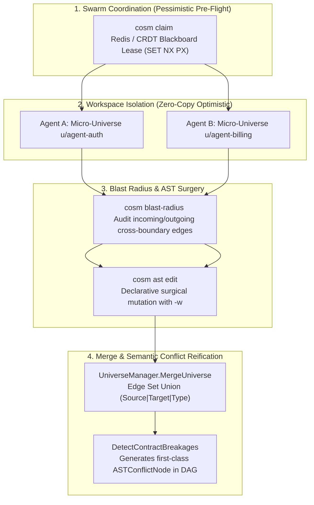

# Multi-Agent Concurrency & Edge Locking Guide

This guide defines the multi-agent concurrency, domain locking, and edge collision resolution workflows for developers and autonomous swarms building applications on top of **Cosm (`cosm`)**.

---

## 1. The Concurrency Paradigm: Why Cosm Eliminates Git File Locks

Traditional source control management (SCM) systems treat repositories as monolithic filesystems. When 20+ autonomous agents concurrently modify code:
1. **Central Ref Lock Bottleneck**: Concurrent pushes to `HEAD` or a central branch trigger push rejections and rebase storms.
2. **File Lock Deadlocks**: Multiple agents attempting to edit adjacent lines in the same file cause text conflict markers (`<<<<<<< HEAD`).
3. **Hidden Contract Drift**: Syntactically clean text merges break cross-domain dependencies (e.g. an agent alters a backend route URL while another agent updates frontend calls without knowing the schema shifted).

Cosm eliminates this friction through a **multi-tiered concurrency architecture**:



---

## 2. Step-by-Step Multi-Agent Workflow

### Step 2.1: Acquire a Pre-Mutation Swarm Lease (`cosm claim`)

Before an autonomous agent begins code analysis or AST mutation on a domain, subsystem, or architectural boundary, it acquires an exclusive **Blackboard Domain Lease**:

```bash
# Claim domain with 10-minute TTL
cosm claim services/billing --ttl 600 --agent "did:key:z6MkuAutonomousBuilder" --goal "Refactoring Stripe webhook handler"

# Inspect active leases across the swarm
cosm blackboard
```

#### Under the Hood:
- **Topocosm Cloud Hub (Redis Backplane)**: Topocosm executes an atomic conditional write:
  ```redis
  SET topocosm:leases:services/billing <ClaimRecordJSON> NX PX 600000
  ```
  If another agent already holds the lease, the call returns `false` (HTTP 409 Conflict).
- **TTL Auto-Expiry**: If an agent process crashes or fails to complete its task, the lease expires automatically without human intervention.
- **Local Fallback**: In standalone local mode, `LocalLeaseManager` enforces thread-safe `sync.RWMutex` leases in memory.

When the mutation and local verification succeed, release the lease immediately:
```bash
cosm release services/billing --agent "did:key:z6MkuAutonomousBuilder"
```

---

### Step 2.2: Branch into an Isolated Micro-Universe

Never write directly to shared branches (`universe-main`). Agents create lightweight, zero-copy micro-universe frontiers:

```bash
# Fork an isolated micro-universe from universe-main
cosm universe create u/agent-billing-stripe -p universe-main
```

Because micro-universes are independent pointers into an immutable content-addressed Merkle-DAG, **agents never hold file or branch locks against one another during development**.

---

### Step 2.3: Audit Cross-Boundary Blast Radius

Before modifying an AST symbol or cross-boundary contract, evaluate incoming and outgoing dependency edges:

```bash
# Check blast radius of the target symbol
cosm blast-radius sym-7a1b2c3d
```

Output includes:
* **Incoming Dependents**: Frontend components or external callers consuming this symbol (`CONSUMES_API`, `CALLS`).
* **Outgoing Dependents**: Cloud infrastructure or database tables targeted by this symbol (`DEPLOYS_TO`, `QUERIES_DB`).
* **Contract Schema Hash**: The interface SHA-256 fingerprint.

---

### Step 2.4: Execute Surgical AST Mutations (`cosm ast edit`)

Use Cosm's Declarative AST Surgery engine instead of whole-file overwrites to modify code:

```bash
# Surgical method body replacement with automatic IDE workspace disk sync
cosm ast edit \
    -u u/agent-billing-stripe \
    --op replace_function_body \
    --target "BillingService.HandleWebhook" \
    --content "return self.process_stripe_event(payload)" \
    --write-disk
```

Benefits:
- Unmodified functions in the same file preserve their identical SHA-256 hashes and require zero Merkle recomputation.
- `--write-disk` (`-w`, default `true`) immediately writes the updated code to disk so Language Servers (`gopls`, `pyright`, `tsserver`) observe changes without manual export.

---

### Step 2.5: Jujutsu-Style Stacked Proposals (`cosm stack`)

When breaking a large feature into sequential agent tasks (e.g. Model $\rightarrow$ API Route $\rightarrow$ UI), stack changes:

```bash
# Create stacked changes
cosm stack create -c c/stripe-model -u u/stripe-model -p universe-main --title "Stripe DB Model"
cosm stack create -c c/stripe-route -u u/stripe-route -p c/stripe-model --title "Stripe API Route"

# When the parent change updates, auto-evolve descendants without text conflict markers:
cosm stack evolve -c c/stripe-model
```

Descendant micro-universes rebase their AST subtrees via AST union operators ($H_C' = \text{MerkleRoot}(H_P' \sqcup \Delta_{\text{AST}}(C))$) without text rebase collisions.

---

### Step 2.6: Proposing Changes & Handling Collisions

When an agent completes its work, open a Universe Proposal:

```bash
cosm proposal create \
    --source u/agent-billing-stripe \
    --target universe-main \
    --title "Feature: Stripe Webhook v2"
```

#### What happens if two agents modify the same edge simultaneously?
If two agents did not use blackboard leases and simultaneously modified endpoints of a `CrossBoundaryEdge`:

1. **Union Edge Deduplication**:
   Identical edges with matching `(SourceID, TargetID, EdgeType)` deduplicate automatically during `UniverseManager.MergeUniverse`.
2. **Contract Breakage Detection**:
   If Agent A updated a server route signature while Agent B modified a client API call against the old signature, `ConflictEngine.CheckConflicts()` flags:
   ```json
   {
     "conflict_type": "ROUTE_CONTRACT_BROKEN",
     "severity": "ERROR",
     "source_id": "services/billing::WebhookHandler",
     "target_id": "web/src/api::postBillingWebhook"
   }
   ```
3. **Non-Blocking AST Conflict Nodes**:
   Cosm **does not fail with a dirty git exit or text conflict markers**. It writes an `ASTConflictNode` into the DAG:
   ```go
   type ASTConflictNode struct {
       ConflictID       string               `json:"conflict_id"`
       TargetSymbolID   string               `json:"target_symbol_id"`
       Conflicting      []ConflictingVersion `json:"conflicting_versions"`
       Status           string               `json:"status"` // UNRESOLVED
   }
   ```
4. **Resolution**:
   Agents resolve conflict nodes explicitly via CLI or AI Critic scorecards:
   ```bash
   cosm ast resolve --conflict <conflict_id> --choose-version <version_index>
   ```

---

## 3. Best Practices Checklist for Agent Orchestrators

- [ ] **Always claim before mutating**: Use `cosm claim <domain>` or SDK `ClaimDomain()` before generating code on shared components.
- [ ] **Release leases promptly**: Call `cosm release <domain>` immediately after proposal submission or on error.
- [ ] **Branch into micro-universes**: Never commit AST nodes directly into `universe-main`.
- [ ] **Inspect blast radius**: Run `cosm blast-radius` to detect dependent cross-boundary edges before modifying function signatures.
- [ ] **Keep disk in sync**: Use `--write-disk` (`-w`) so local compilers, linters, and test runners (`go test`, `uv run pytest`) immediately see mutations.
- [ ] **Prefer stacked proposals**: Break multi-tier fullstack tasks across backend, frontend, and cloud infra into stacked changes with `cosm stack create`.
