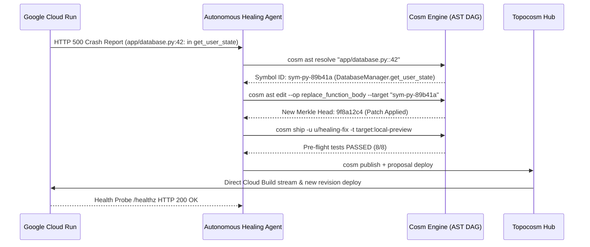

# Tiered Dual-Loop Deployment Guide: Cosm, Topocosm, Cloud Run & GitHub Actions

This guide provides a comprehensive operational and architectural manual for the **Tiered Dual-Loop Deployment Paradigm**. It explains how autonomous AI agents and engineering teams develop, test, and deploy software stored as **content-addressed AST Merkle-DAGs** without relying on legacy human file shims or experiencing disk I/O bottlenecks.

---

## 1. Architectural Overview: Inner Loop vs. Outer Loop

```
┌────────────────────────────────────────────────────────────────────────────────────────┐
│ 1. INNER LOOP: Local Agent Iteration (Sub-Second Latency, Zero Network)                │
│                                                                                        │
│   Agent Mutation ──> Cosm AST Merkle-DAG ──> `cosm ship` (RAM Staging) ──> Preview Port │
└───────────────────────────────────────────┬────────────────────────────────────────────┘
                                            │ Push AST Delta (Only modified hashes, < 5KB)
                                            ▼
┌────────────────────────────────────────────────────────────────────────────────────────┐
│ 2. OUTER LOOP: Topocosm Cloud Backplane (`topocosm.dev`)                               │
│                                                                                        │
│   • Centralized CAS Object Store (Google Cloud Storage / GCS / SQLite WAL)            │
│   • Multi-Agent Proposal Mesh & CRDT State Synchronization                             │
│   • Cloud Sandbox & Build Orchestration Engine                                         │
└───────────────────────┬──────────────────────────────────────┬─────────────────────────┘
                        │ (A) Sparse AST Fetch                 │ (B) In-Memory Stream
                        ▼                                      ▼
     ┌────────────────────────────────────┐ ┌────────────────────────────────────┐
     │         GitHub Actions CI          │ │      Google Cloud Run / Build      │
     │  `uses: cosmscm/topocosm-action`   │ │  Direct `cloudbuild.googleapis.com`│
     │  • Sparse hydration (< 300ms)      │ │  • Zero local tarball upload       │
     │  • Matrix test execution           │ │  • Instant revision deployment    │
     └──────────────────┬─────────────────┘ └──────────────────┬─────────────────┘
                        │                                      │
                        └───────────────┬──────────────────────┘
                                        │ Report Build Badges & Cloud URLs
                                        ▼
┌────────────────────────────────────────────────────────────────────────────────────────┐
│ 3. Universe Proposal Review Card (Autonomous Critic Consensus & Merge Gate)           │
│    • AST Symbol Diff  • Blast Radius Score  • Cloud Run URL  • CI Badges (Green)       │
└────────────────────────────────────────────────────────────────────────────────────────┘
```

---

## 2. Example 1: Local Agent Inner-Loop (`cosm ship`)

When an agent is actively coding, generating tests, or fixing a bug in an isolated micro-universe (`u/agent-feature-1`), it uses `cosm ship`.

### Step 1: Create an Isolated Micro-Universe
```bash
cosm universe create u/agent-auth-feature --parent universe-main
```

### Step 2: Apply Surgical AST Mutation
```bash
cosm ast edit \
  --u u/agent-auth-feature \
  --op replace_function_body \
  --target "app/database.py::DatabaseManager.get_user_state" \
  --content "return self.session.query(UserState).filter_by(user_id=user_id).first()"
```

### Step 3: Ship and Validate in Ephemeral RAM Sandbox
```bash
cosm ship -u u/agent-auth-feature -t target:local-preview --format json
```

**Machine-Readable Response Received by Agent:**
```json
{
  "status": "SUCCESS",
  "target": "target:local-preview",
  "universe_id": "u/agent-auth-feature",
  "merkle_root": "6a9e142b98fae81b28d7",
  "artifact_id": "art-preview-1982",
  "artifact_path": "dist/local-preview-bundle.tar.gz",
  "preview_url": "http://127.0.0.1:8080",
  "healthy": true,
  "size_bytes": 128450
}
```

*Latency*: $< 50\text{ms}$. No disk litter, no network overhead.

---

## 3. Example 2: Zero-Disk In-Memory Cloud Build Stream

When deploying an AST Merkle-DAG state to Google Cloud Build without touching local disk:

```bash
# Stream in-memory AST tarball directly to Cloud Build via stdin pipe
cosm export --format tar -u universe-main | gcloud builds submit \
    --project davenport-boutique \
    --region us-central1 \
    --tag gcr.io/davenport-boutique/adk-agent-prod:latest \
    --tar-source -
```

### Why this works:
1. `cosm export --format tar` walks the Merkle DAG in RAM and streams gzip-compressed tar bytes directly to `os.Stdout`.
2. `gcloud builds submit --tar-source -` consumes standard input, uploads the stream directly to the Google Cloud Storage staging bucket, and triggers Cloud Build VMs.
3. **Local disk writes: Exactly 0 bytes.**

---

## 4. Example 3: Topocosm Cloud CAS Dispatch (The Agent-Native Outer Loop)

In an agent swarm architecture, the local machine should never spend bandwidth uploading heavy build contexts.

### Step 1: Commit and Push Incremental AST Delta
```bash
# Commits AST nodes with causal lineage
cosm commit -u u/agent-auth-feature -i "feat: add user state persistence" -p "Implement PostgreSQL user state"

# Pushes only modified AST symbol hashes (< 5KB) to Topocosm Hub
cosm publish -u u/agent-auth-feature --remote topocosm://topocosm.dev/my-org/adk-agent
```

### Step 2: Create Universe Proposal & Trigger Cloud Run Target Deployment
```bash
# Create Proposal and trigger automated Cloud Run deployment on Topocosm
curl -X POST https://topocosm.dev/api/v1/cosms/my-org/adk-agent/proposals/prop-101/deploy \
  -H "Content-Type: application/json" \
  -H "X-Cosm-DID: did:key:z6MkuAutonomousAgent" \
  -d '{
    "target_name": "cloud-run",
    "project_id": "davenport-boutique",
    "region": "us-central1"
  }'
```

**Topocosm Cloud Dispatcher Response:**
```json
{
  "status": "SUCCESS",
  "target_name": "cloud-run",
  "universe_id": "u/agent-auth-feature",
  "merkle_root": "6a9e142b98fae81b28d7",
  "artifact_id": "art-u/agent-auth-feature-49102",
  "endpoint_url": "https://cosm-svc-u-agent-auth-feature-txgsracloq-uc.a.run.app",
  "build_duration_ms": 12840,
  "healthy": true,
  "message": "Successfully deployed universe 'u/agent-auth-feature' to target 'cloud-run'",
  "timestamp": "2026-09-01T20:58:00Z"
}
```

---

## 5. Example 4: GitHub Actions CI Matrix with Sparse AST Hydration

Traditional CI runners waste 45 seconds cloning multi-gigabyte monorepos. With Topocosm's sparse AST hydration, CI setup finishes in $< 300\text{ms}$.

```yaml
# .github/workflows/verify-ast-proposal.yml
name: Topocosm AST Verification Matrix
on:
  pull_request:
    branches: [ main ]
  workflow_dispatch:

jobs:
  verify-backend:
    name: Backend AST Verification (Python + ADK)
    runs-on: ubuntu-latest
    steps:
      - name: Sparse Hydrate Backend AST from Topocosm
        uses: cosmscm/topocosm-action@v1
        with:
          topocosm_url: "https://topocosm.dev"
          repo: "my-org/adk-agent"
          universe_id: "u/agent-auth-feature"
          components: "app/database.py,app/main.py,app/agent.py,pyproject.toml"
          token: ${{ secrets.TOPOCOSM_TOKEN }}

      - name: Set up Python with uv
        uses: astral-sh/setup-uv@v2

      - name: Run Hermetic Unit Tests
        run: |
          uv run pytest tests/test_api.py -v

  verify-infra:
    name: Infrastructure Contract Verification (Terraform HCL)
    runs-on: ubuntu-latest
    steps:
      - name: Sparse Hydrate Terraform AST from Topocosm
        uses: cosmscm/topocosm-action@v1
        with:
          topocosm_url: "https://topocosm.dev"
          repo: "my-org/adk-agent"
          universe_id: "u/agent-auth-feature"
          components: "infra/main.tf,infra/variables.tf,infra/outputs.tf"
          token: ${{ secrets.TOPOCOSM_TOKEN }}

      - name: Setup Terraform
        uses: hashicorp/setup-terraform@v3

      - name: Terraform Format & Validate
        run: |
          terraform fmt -check infra/
          terraform -chdir=infra init -backend=false
          terraform -chdir=infra validate
```

---

## 6. Example 5: Closed-Loop Self-Healing Agent Workflow

When a production runtime error occurs on Google Cloud Run, an autonomous agent executes a zero-human self-healing loop:



---

## 7. Example 6: Multi-Agent Concurrent Swarm Scaling

When 50 agents run concurrently (e.g. parallel bug fixing or Monte Carlo hypothesis exploration):
* **FUSE / Disk approach**: 50 mounts $\rightarrow$ Kernel lock contention & inode exhaustion.
* **Tiered Dual-Loop approach**: 50 micro-universes branch with **zero-copy in SQLite WAL**, test locally in RAM via `cosm ship`, and push $< 5\text{KB}$ delta hashes to Topocosm CAS.
* **Throughput**: $> 1,000$ concurrent agent operations per second.

---

## 8. Summary Comparison

| Metric | Inner Loop (`cosm ship`) | Topocosm Cloud CAS Dispatch | GitHub Actions CI |
| :--- | :--- | :--- | :--- |
| **Execution Tier** | Local agent runtime | Topocosm Cloud Backplane | GitHub Runner VM |
| **Payload Size** | 0 bytes (Pure RAM) | $< 5\text{KB}$ incremental hash deltas | Minimal sparse AST subtrees |
| **Build Target** | Local preview sandbox | Google Cloud Run / Cloud Build | Matrix test runners |
| **Feedback Latency** | $< 50\text{ms}$ | $< 15\text{s}$ (Cloud-to-Cloud) | Standard CI execution |
| **Artifact State** | Ephemeral RAM | Cryptographic Merkle Hash | Check run badge |
