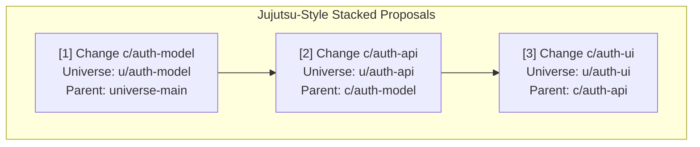

# Federated Multi-Repo AST Source Control & Replication Reference

This document defines the mathematical models, data schemas, replication protocols, and developer workflows for **AST Federation across Multi-Repository Ecosystems** in `cosm`.

---

## 1. System Vision: Breaking the Multi-Repo Isolation Barrier

In enterprise software engineering, applications are partitioned across dozens or hundreds of physical Git repositories (e.g., `payment-service`, `checkout-web`, `cloud-infra`, `schema-registry`). In traditional version control:
* Repositories are disconnected text silos with no cross-boundary type checking.
* A single feature requiring cross-repo changes requires coordinating multiple unlinked Pull Requests, risking runtime breakages and manual merge ordering mistakes.
* AI agents waste 90%+ of their context windows ingesting irrelevant boilerplate files.

Cosm resolves this by organizing code as a **Federated AST Merkle-DAG**:
* **Local Autonomy**: Repositories retain their independent namespaces, release lifecycles, and access boundaries.
* **Semantic Cross-Boundary Typing**: Typed contracts (`CONSUMES_API`, `IMPLEMENTS_RPC`, `QUERIES_TABLE`, `BINDS_ENV`, `DEPLOYS_TO`) link AST symbols across repository boundaries using content-addressed identifiers.
* **Decentralized Replication**: Peers (engineers, agents, CI runners) replicate only the necessary AST subtrees using CRDT Collaborative Objects (COBs).

```
ENTERPRISE MULTI-REPO CONTINUUM
┌──────────────────────────────────────────────────────────────────────────────────┐
│                             FEDERATED AST MERKLE-DAG                             │
│                                                                                  │
│   [Checkout.tsx] ────(CONSUMES_API)────> [ChargeRoute] ────(DEPLOYS_TO)────> [ecs.tf]
│        │                                       │                                  │
│   (AST Symbol)                            (AST Symbol)                       (AST Symbol)
│        │                                       │                                  │
│   Cosm Repository:                        Cosm Repository:                   Cosm Repository:
│   "acme/checkout-web"                     "acme/payment-backend"             "acme/cloud-infra"
└──────────────────────────────────────────────────────────────────────────────────┘
```

---

## 2. Four Boundary Tiers in AST Version Control

Cosm defines boundaries based on **semantic cohesion** and **compilation scopes** rather than filesystem folders:

```
Tier 3: Federated Multi-Repo Scope  (cosm://org/repo/component@hash)
               │
Tier 2: Architectural Subsystem     (ComponentNode: services/billing, web/src)
               │
Tier 1: Cross-Domain Contract       (CrossBoundaryEdge: CONSUMES_API, IMPLEMENTS_RPC)
               │
Tier 0: Atomic AST Symbol           (ASTSymbolNode: Function, Struct, Resource, Table)
```

### Boundary Definitions

| Boundary Tier | Definition & Trigger | Scope & Enforcement |
| :--- | :--- | :--- |
| **1. Closed Compilation Boundary (Project Scope)** | Triggered by package manifests (`go.mod`, `package.json`, `Cargo.toml`, `main.tf`). | Internal symbol resolution handled by language parser; no explicit wire schema required. |
| **2. Architectural Component Boundary** | High-cohesion symbol clusters within a service (`services/auth`, `frontend/ui`). | Grouped into a `ComponentNode` with an individual Merkle root. |
| **3. Cross-Domain Contract Boundary** | Crosses runtime, language, or network boundaries (REST, gRPC, SQL DDL, Terraform variables). | Requires a content-addressed `ContractSchemaID`. Breaking changes are statically rejected at commit time. |
| **4. Federated Multi-Repo Boundary** | Distinct physical repositories owned by different teams or stored in separate forges. | Connected via content-addressed URIs (`cosm://<org>/<repo>/<component>@<hash>`). |

---

## 3. Mathematical Model for Distributed Replication & Time Tracking

In a decentralized peer-to-peer or federated network without a central clock authority, physical timestamps (`time.Now()`) cannot guarantee causal correctness. Cosm uses **Lamport Logical Clocks** combined with **Causal Merkle Ancestry**.

### 3.1 Logical Time & Event Ordering

Each replica (human or agent $i$) maintains a monotonically increasing integer clock $L_i \in \mathbb{N}$:

1. **Local Mutation**: Before committing a local AST mutation $e$:
   $$L_i \leftarrow L_i + 1$$
2. **Network Replication**: When replica $i$ receives a message with timestamp $L_{\text{msg}}$:
   $$L_i \leftarrow \max(L_i, L_{\text{msg}}) + 1$$

### 3.2 Deterministic Total Ordering

To break ties when two replicas commit at the exact same logical clock tick, Cosm applies a total order $\prec$ using cryptographic Decentralized Identifiers ($\text{DID}$):

$$\text{Event}(A) \prec \text{Event}(B) \iff \begin{cases} 
L(A) < L(B) \\
L(A) = L(B) \land \text{DID}(A) < \text{DID}(B) 
\end{cases}$$

### 3.3 CRDT State Convergence (Semilattice Join $\sqcup$)

Collaborative Objects (such as `ProposalCOB` and `BlackboardCOB`) are state-based CRDTs. When two replicas synchronize, their states converge using a deterministic, idempotent, commutative, and associative join operator $\sqcup$:

$$S_{\text{merged}} = S_A \sqcup S_B$$

* **Revisions**: $\mathcal{R}_{\text{merged}} = \mathcal{R}_A \cup \mathcal{R}_B$
* **Comments**: $\mathcal{C}_{\text{merged}} = \mathcal{C}_A \cup \mathcal{C}_B$
* **Approvals**: $\mathcal{A}_{\text{merged}} = \mathcal{A}_A \cup \mathcal{A}_B$
* **Status**: Converges monotonically according to the lattice:
  $$\text{OPEN} \prec \text{CHANGES\_REQUESTED} \prec \text{APPROVED} \prec \text{MERGED}$$

---

## 4. First-Class Stacked Change Chains (`cosm stack`)

In enterprise multi-repo development, large features are decomposed into small, dependent change layers (e.g. `Database Schema` $\rightarrow$ `API Route` $\rightarrow$ `Frontend UI` $\rightarrow$ `Terraform Policy`).



### Auto-Evolution Mechanics (`cosm stack evolve`)

In traditional Git, modifying `c/auth-model` requires manually rebasing `c/auth-api` and `c/auth-ui`, frequently causing text conflict collisions at each stage.

In Cosm:
1. Changes are stored as scoped **AST symbol deltas** rather than raw line diffs.
2. When the parent change root updates to $H_P'$, the `StackManager` automatically merges the child AST changes onto $H_P'$ using the AST union operator:
   $$H_C' = \text{MerkleRoot}(H_P' \sqcup \Delta_{\text{AST}}(C))$$
3. Descendants evolve instantly with zero text merge conflicts unless an exact AST symbol declaration was modified incompatibly.

---

## 5. Dual Materialization: Agent Slices vs. Human Workspaces

Cosm bridges the gap between AI agent efficiency and human developer ergonomics:

```
                              AST Merkle-DAG (.cosm/objects/)
                                             │
                      ┌──────────────────────┴──────────────────────┐
                      ▼                                             ▼
        [FOR AI AGENTS / SWARMS]                      [FOR HUMAN DEVELOPERS]
     Topological AST Slice (2 KB - 5 KB)           Full AST Hydration to Disk (Files)
     • Target Symbol Payload                       • Real .go, .tsx, .tf, .py files
     • 1-Hop Contract Signatures                   • Normal VS Code / Cursor / Neovim
     • 80%–99% Scale-Dependent Token Reduction     • Synthetic Git CLI Interceptor
```

For full mathematical derivation and empirical tables across 5- to 100-component repositories, see [Empirical Benchmarks & Savings Reference](file:///Users/jasondavenport/GitHub/cosm/docs/reference/empirical-benchmarks-and-savings.md).

### 5.1 AI Agents: Topological AST Slices
* Agents receive only the target symbol and its 1-hop contract dependencies (omitting bodies of unchanged code).
* Edits are submitted as **9 Declarative AST Verbs** (`replace_function_body`, `add_method`, `add_import`), preventing transcription hallucination.

### 5.2 Humans & IDEs: Full AST Hydration
* Humans run `cosm clone <url> ./workspace`.
* Cosm's **Hydration Engine** (`pkg/materialize/`) writes real files and directories to disk.
* Cosm's **Git Shim** (`pkg/gitshim/`) intercepts standard `git status`, `git diff`, and `git commit` commands, providing 100% compatibility with existing IDEs and build scripts.

---

## 6. Multi-Repo Cross-Boundary Schemas (`pkg/core/schema.go`)

```go
// FederatedSymbolRef uniquely identifies an AST symbol across the global federation mesh.
type FederatedSymbolRef struct {
    OrgSlug        string `json:"org_slug"`        // e.g. "acme-corp"
    CosmName       string `json:"cosm_name"`       // e.g. "payment-backend"
    UniverseID     string `json:"universe_id"`     // e.g. "universe-main"
    SymbolID       string `json:"symbol_id"`       // Content-addressed SHA-256
    Identifier     string `json:"identifier"`      // e.g. "services/billing::ChargeCard"
}

// FederatedCrossBoundaryEdge defines typed semantic dependencies linking distinct repositories.
type FederatedCrossBoundaryEdge struct {
    Source           FederatedSymbolRef `json:"source"`
    Target           FederatedSymbolRef `json:"target"`
    Type             EdgeType           `json:"type"`             // CONSUMES_API, IMPLEMENTS_RPC, etc.
    ContractSchemaID string             `json:"contract_schema_id"` // SHA-256 hash of interface contract
    Lineage          LineageEnvelope    `json:"lineage"`
}

// FederatedManifestNode represents a composite super-DAG snapshot linking multiple independent Cosms.
type FederatedManifestNode struct {
    FederationID   string                       `json:"federation_id"`
    MerkleRootHash string                       `json:"merkle_root_hash"`
    CosmHeads      map[string]string            `json:"cosm_heads"`      // "org/repo" -> Manifest Hash
    CrossEdges     []FederatedCrossBoundaryEdge `json:"cross_edges"`
    CreatedAt      time.Time                    `json:"created_at"`
    Lineage        LineageEnvelope              `json:"lineage"`
}
```

---

## 7. Developer CLI Reference

```bash
# 1. Clone a remote federated Cosm to local disk
cosm clone http://topocosm.dev/acme/payment-backend ./payment-backend

# 2. Extract a sparse AST subtree for an isolated agent task
cosm clone http://topocosm.dev/acme/payment-backend ./billing-slice --sparse "services/billing"

# 3. Create a Jujutsu-style stacked proposal
cosm stack create -c c/payment-db -u u/payment-db -p universe-main --title "Add Stripe tables"
cosm stack create -c c/payment-api -u u/payment-api -p c/payment-db --title "Add Charge endpoint"

# 4. Auto-evolve stack when base changes
cosm stack evolve -c c/payment-db

# 5. Inspect cross-repo blast radius
cosm blast-radius services/billing::ChargeCard

# 6. Publish to federated hub
cosm publish http://topocosm.dev/acme/payment-backend --universe universe-main --intent "Release v2.0"
```

---

## 8. Multi-Region Symmetric Swarm & Topocosm Leaderless Team

Topocosm hubs replicate AST Merkle-DAG chunks across cloud regions (e.g., `us-central1`, `europe-west1`, `asia-east1`) using a **BitTorrent-inspired symmetric leaderless swarm**:

* **Gossip Peer Exchange (PEX)**: Dynamically forms the team mesh via peer announcement handshakes (`/api/v1/swarm/peers/announce`).
* **Shared Storage Heartbeats**: Autonomous discovery via TTL leases in shared object storage (`mesh/peers/node-<id>.json`).
* **BitTorrent/Bitswap Chunk Availability**: Nodes announce new commits via `HaveMessage` broadcasts; missing AST blobs are lazily fetched on-demand (`GET /api/v1/blobs/{hash}`) with cryptographic SHA-256 verification and local CAS caching.
* **CRDT Eventual Consistency**: Cosm machine runtimes can push or pull from any regional teammate node; universe heads and stacked proposals converge via semilattice join ($\sqcup$).
