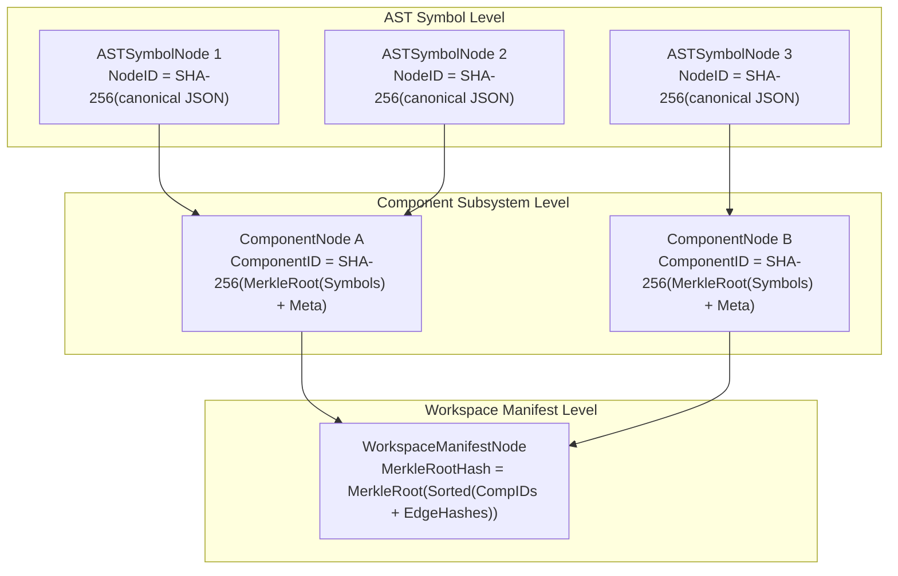

# Schema & Storage Engine Reference

Technical specification of Cosm's internal data structures, Merkle-DAG algorithms, distributed CRDT collaboration models, and durable storage engine.

---

## 1. Core Domain Enums (`pkg/core/schema.go`)

| Enum Type | Defined Constants | Purpose / Semantics |
| :--- | :--- | :--- |
| `Language` | `go`, `typescript`, `python`, `hcl`, `rust`, `java`, `sql`, `protobuf`, `cpp`, `c`, `raw` | Identifies AST codec and language parsing/hydration semantics |
| `ComponentType` | `service`, `library`, `frontend`, `database`, `infra`, `model`, `contract` | Architectural subsystem classification |
| `EdgeType` | `CALLS`, `CONSUMES_API`, `DEPLOYS_TO`, `BINDS_ENV`, `DEPENDS_ON`, `QUERIES_TABLE`, `IMPLEMENTS_RPC` | Semantic cross-boundary dependency link types |
| `BreakageSeverity` | `CRITICAL`, `WARNING`, `INFO` | Impact classification for detected contract violations |
| `BreakageType` | `ROUTE_REMOVED`, `TABLE_REMOVED`, `RPC_REMOVED`, `ENV_VAR_MISSING`, `DEPLOY_TARGET_MISSING` | Category of cross-domain breakage |
| `TargetKind` | `local-service`, `cloud-run`, `static-web`, `terraform-infra`, `composite` | Target build & deployment runtime category |
| `DriftType` | `COMPONENT_ADDED`, `COMPONENT_REMOVED`, `COMPONENT_MODIFIED`, `ENV_VAR_MISSING`, `ENDPOINT_CHANGED`, `RESOURCE_DRIFT` | Classification of target environment drift |
| `COBType` | `proposal`, `review`, `blackboard` | Decentralized collaborative object type |
| `ReviewStatus` | `OPEN`, `UNDER_REVIEW`, `CHANGES_REQUESTED`, `APPROVED`, `MERGED`, `CLOSED` | Proposal review workflow lifecycle status |

---

## 2. Four Boundary Tiers in AST Version Control

Cosm defines boundaries based on **semantic cohesion** and **compilation scopes** rather than directory trees:

1. **Closed Compilation Boundary (Project Scope)**:
   * Defined by language build manifests (`go.mod`, `package.json`, `Cargo.toml`, `main.tf`).
   * Internal symbol references resolve via language AST parsers; no explicit wire schema required.
2. **Architectural Component Boundary**:
   * Cohesive symbol subgraphs within a project (`services/auth`, `frontend/ui`).
   * Grouped into a `ComponentNode` with an individual Merkle root.
3. **Cross-Domain Contract Boundary**:
   * Crosses runtime, language, or network boundaries (REST APIs, gRPC RPCs, SQL DDL, Terraform variables).
   * Backed by a content-addressed `ContractSchemaID`. Breaking changes are statically rejected at commit time.
4. **Federated Multi-Repo Boundary**:
   * Autonomous repositories owned by different teams or stored in separate forges.
   * Bound together via URIs (`cosm://<org>/<repo>/<component>@<hash>`).

---

## 3. Core AST & Merkle-DAG Models (`pkg/core/schema.go`)

### `TokenTelemetry`
Captures granular LLM token consumption metrics, latency, and financial costs:
```go
type TokenTelemetry struct {
    PromptTokens     int64   `json:"prompt_tokens,omitempty"`
    CompletionTokens int64   `json:"completion_tokens,omitempty"`
    ReasoningTokens  int64   `json:"reasoning_tokens,omitempty"`
    CachedTokens     int64   `json:"cached_tokens,omitempty"`
    TotalTokens      int64   `json:"total_tokens,omitempty"`
    CostUSD          float64 `json:"cost_usd,omitempty"`
    LatencyMs        int64   `json:"latency_ms,omitempty"`
    TTFTMs           int64   `json:"ttft_ms,omitempty"`
}
```

---

### `TraceCarrier`
Carries W3C distributed trace context and OpenTelemetry span correlation:
```go
type TraceCarrier struct {
    TraceID      string            `json:"trace_id,omitempty"`
    SpanID       string            `json:"span_id,omitempty"`
    TraceFlags   string            `json:"trace_flags,omitempty"`
    ParentSpanID string            `json:"parent_span_id,omitempty"`
    TraceState   string            `json:"trace_state,omitempty"`
    Attributes   map[string]string `json:"attributes,omitempty"`
}
```

---

### `LineageEnvelope`
Stores unbroken causal provenance metadata bound to every mutation:
```go
type LineageEnvelope struct {
    UserID              string         `json:"user_id,omitempty"`
    UserPrompt          string         `json:"user_prompt,omitempty"`
    SessionID           string         `json:"session_id,omitempty"`
    OrchestratorAgentID string         `json:"orchestrator_agent_id,omitempty"`
    ExecutingAgentID    string         `json:"executing_agent_id,omitempty"`
    LLMVersion          string         `json:"llm_version,omitempty"`
    GenerationParams    string         `json:"generation_params,omitempty"`
    Intent              string         `json:"intent,omitempty"`
    Timestamp           time.Time      `json:"timestamp"`
    Tokens              TokenTelemetry `json:"tokens,omitempty"`
    Trace               TraceCarrier   `json:"trace,omitempty"`
    SignatureEd25519    []byte         `json:"signature_ed25519,omitempty"`
}
```

---

### `ASTSymbolNode`
The discrete atom of the codebase (e.g. function, struct, interface, route binding, SQL table, Terraform resource block, or raw non-AST file):
```go
type ASTSymbolNode struct {
    NodeID            string            `json:"node_id"`            // SHA-256 deterministic content hash
    Language          Language          `json:"language"`           // "go", "hcl", "typescript", "raw", etc.
    NodeType          string            `json:"node_type"`          // e.g. "FunctionDecl", "ResourceBlock", "RawBlobNode"
    Identifier        string            `json:"identifier"`         // Symbol name (or relative file path for RawBlobNode)
    Signature         string            `json:"signature,omitempty"`// e.g. "func(w http.ResponseWriter, r *http.Request)"
    Docstring         string            `json:"docstring,omitempty"`
    Visibility        string            `json:"visibility,omitempty"`// "public", "private", "exported"
    ASTPayload        []byte            `json:"ast_payload"`        // Serialized AST node bytes or verbatim file content
    ASTMetadata       map[string]string `json:"ast_metadata,omitempty"`
    LocalDependencies []string          `json:"local_dependencies,omitempty"` // Symbol IDs depended upon in component
    Dependencies      []string          `json:"dependencies,omitempty"`
    Lineage           LineageEnvelope   `json:"lineage"`
}
```

> [!NOTE]
> **Raw Non-AST Files**: For unstructured files (e.g. `LICENSE`, `README.md`, `.gitignore`, configs, and assets), `NodeType` is set to `"RawBlobNode"`, `Language` is set to `"raw"`, `Identifier` contains the relative file path, and `ASTPayload` stores the exact unparsed byte content. Hydration materializes these nodes verbatim without alteration.

---

### `CrossBoundaryEdge`
Encapsulates typed semantic relationships bridging different programming languages or architectural boundaries:
```go
type CrossBoundaryEdge struct {
    SourceNodeID     string            `json:"source_node_id"`
    TargetNodeID     string            `json:"target_node_id"`
    Type             EdgeType          `json:"type"`             // CALLS, CONSUMES_API, DEPLOYS_TO, etc.
    ContractSchemaID string            `json:"contract_schema_id,omitempty"`
    Metadata         map[string]string `json:"metadata,omitempty"`
    Lineage          LineageEnvelope   `json:"lineage"`
}
```

---

### `ComponentNode`
Subsystem grouping of symbol nodes with its own binary Merkle root:
```go
type TriviaEnvelope struct {
    HeaderDirectives []string `json:"header_directives,omitempty"` // e.g. //go:build, //go:embed, # -*- coding
    LicenseHeader    string   `json:"license_header,omitempty"`
    ModuleDocstring  string   `json:"module_docstring,omitempty"`
}

type ComponentNode struct {
    ComponentID string            `json:"component_id"` // Merkle root hash of sorted symbol hashes
    Name        string            `json:"name"`         // e.g. "services/billing", "frontend/auth"
    Type        ComponentType     `json:"type"`         // service, database, infra, etc.
    Language    Language          `json:"language"`
    SymbolNodes []string          `json:"symbol_nodes"` // List of ASTSymbolNode NodeIDs
    Trivia      *TriviaEnvelope   `json:"trivia,omitempty"` // Top-of-file directives, pragmas, and license
    Metadata    map[string]string `json:"metadata,omitempty"`
    Lineage     LineageEnvelope   `json:"lineage"`
}
```

> [!NOTE]
> **Lossless Trivia Preservation**: Polyglot codecs capture top-of-file build directives (e.g., `//go:build !ignore`), encoding pragmas (e.g., `# -*- coding: utf-8 -*-`), license commentary blocks, and module docstrings into `ComponentNode.Trivia`. When hydrating AST components into ephemeral staging sandboxes or disk files, `pkg/materialize/hydrator.go` prepends these directives ahead of package headers and import lists to ensure lossless, byte-level compilation compatibility.

---

### `WorkspaceManifestNode`
The content-addressed Merkle root of an entire micro-universe:
```go
type WorkspaceManifestNode struct {
    WorkspaceID    string              `json:"workspace_id"`
    UniverseID     string              `json:"universe_id"`      // Branch / micro-universe identifier
    MerkleRootHash string              `json:"merkle_root_hash"` // Binary pairwise Merkle root hash
    Components     []string            `json:"components"`       // ComponentNode ComponentIDs
    CrossEdges     []CrossBoundaryEdge `json:"cross_edges"`      // Cross-domain contract edges
    Lineage        LineageEnvelope     `json:"lineage"`
    CreatedAt      time.Time           `json:"created_at"`
}
```

---

### `ASTTreeGraph` & Hierarchical Projection
The canonical projection DTO for inspecting the full AST Merkle hierarchy, components, symbols, and cross-boundary edges across micro-universes:

```go
type ASTTreeGraph struct {
    UniverseID      string              `json:"universe_id"`
    MerkleRoot      string              `json:"merkle_root"`
    ManifestHash    string              `json:"manifest_hash,omitempty"`
    TotalComponents int                 `json:"total_components"`
    TotalSymbols    int                 `json:"total_symbols"`
    TotalEdges      int                 `json:"total_edges"`
    Components      []*ASTTreeComponent `json:"components"`
    Lineage         *ASTTreeLineage     `json:"lineage,omitempty"`
}

type ASTTreeComponent struct {
    ComponentID string           `json:"component_id"`
    Name        string           `json:"name"`
    Language    core.Language    `json:"language"`
    Type        string           `json:"type"`
    Symbols     []*ASTTreeSymbol `json:"symbols"`
    Lineage     *ASTTreeLineage  `json:"lineage,omitempty"`
}

type ASTTreeSymbol struct {
    NodeID        string          `json:"node_id"`
    Identifier    string          `json:"identifier"`
    NodeType      string          `json:"node_type"`
    Language      core.Language   `json:"language"`
    Signature     string          `json:"signature,omitempty"`
    Docstring     string          `json:"docstring,omitempty"`
    Visibility    string          `json:"visibility,omitempty"`
    Dependencies  []string        `json:"dependencies,omitempty"`
    OutgoingEdges []*ASTTreeEdge  `json:"outgoing_edges,omitempty"`
    Lineage       *ASTTreeLineage `json:"lineage,omitempty"`
}

type ASTTreeEdge struct {
    SourceNodeID     string            `json:"source_node_id,omitempty"`
    TargetID         string            `json:"target_id"`
    TargetNodeID     string            `json:"target_node_id,omitempty"`
    EdgeType         core.EdgeType     `json:"edge_type"`
    Type             core.EdgeType     `json:"type,omitempty"`
    Label            string            `json:"label,omitempty"`
    ContractSchemaID string            `json:"contract_schema_id,omitempty"`
    Metadata         map[string]string `json:"metadata,omitempty"`
}
```

#### CLI Inspection: `cosm ast tree`
Inspects and visualizes the complete AST Merkle Tree hierarchy for a micro-universe:

```bash
cosm ast tree [-u universe] [--format text|json]
```

- `-u`, `--universe <id>`: Target micro-universe to inspect (defaults to `universe-main`).
- `--format`, `-f <text|json>`: Output format (defaults to `text`).
  - `text`: Formatted ASCII tree view with component symbols, language badges, signatures, and contracts.
  - `json`: Machine-readable `ASTTreeGraph` payload consumed by the VS Code extension (`cosm.astTreeView`), language servers, and autonomous agent swarms.

---

## 4. Federated Multi-Repo Models (`pkg/core/schema.go`)

```go
// FederatedSymbolRef uniquely identifies an AST symbol across the global federation mesh.
type FederatedSymbolRef struct {
    OrgSlug        string `json:"org_slug"`        // e.g. "acme-corp"
    CosmName       string `json:"cosm_name"`       // e.g. "payment-backend"
    UniverseID     string `json:"universe_id"`     // e.g. "universe-main"
    SymbolID       string `json:"symbol_id"`       // Content-addressed SHA-256
    Identifier     string `json:"identifier"`      // e.g. "services/billing::ChargeCard"
}

// FederatedCrossBoundaryEdge defines typed dependencies linking distinct repositories.
type FederatedCrossBoundaryEdge struct {
    Source           FederatedSymbolRef `json:"source"`
    Target           FederatedSymbolRef `json:"target"`
    Type             EdgeType           `json:"type"`             // CONSUMES_API, IMPLEMENTS_RPC, etc.
    ContractSchemaID string             `json:"contract_schema_id"` // SHA-256 hash of interface contract
    Lineage          LineageEnvelope    `json:"lineage"`
}

// FederatedManifestNode represents a composite super-DAG snapshot linking multiple independent Cosms.
type FederatedManifestNode struct {
    FederationID   string                       `json:"federation_id"`
    MerkleRootHash string                       `json:"merkle_root_hash"`
    CosmHeads      map[string]string            `json:"cosm_heads"`      // "org/repo" -> Manifest Hash
    CrossEdges     []FederatedCrossBoundaryEdge `json:"cross_edges"`
    CreatedAt      time.Time                    `json:"created_at"`
    Lineage        LineageEnvelope              `json:"lineage"`
}
```

---

## 5. Distributed CRDT & Collaboration Models (`pkg/distributed/`)

### `ProposalCOB` (Collaborative Object)
State-based CRDT representing decentralized proposals with Lamport clocks:
```go
type ProposalCOB struct {
    ID             string               `json:"id"`
    Type           COBType              `json:"type"`             // "proposal"
    Title          string               `json:"title"`
    TargetUniverse string               `json:"target_universe"`  // Base branch
    AuthorDID      string               `json:"author_did"`       // Decentralized ID
    Status         ReviewStatus         `json:"status"`
    CreatedAt      time.Time            `json:"created_at"`
    Revisions      []ProposalRevision   `json:"revisions"`
    Comments       []ReviewComment      `json:"comments"`
    Approvals      map[string]bool      `json:"approvals"`        // DID -> Approved
    FitnessScore   float64              `json:"fitness_score"`
    Lineage        core.LineageEnvelope `json:"lineage"`
    LamportClock   uint64               `json:"lamport_clock"`
}
```

---

### `ASTConflictNode`
Non-blocking first-class conflict node stored directly in the AST Merkle DAG:
```go
type ASTConflictNode struct {
    ConflictID       string               `json:"conflict_id"`
    TargetSymbolID   string               `json:"target_symbol_id"`
    TargetIdentifier string               `json:"target_identifier"`
    Language         core.Language        `json:"language"`
    BaseASTHash      string               `json:"base_ast_hash,omitempty"`
    Conflicting      []ConflictingVersion `json:"conflicting_versions"`
    Resolution       *ConflictingVersion  `json:"resolution,omitempty"`
    ResolvedAt       *time.Time           `json:"resolved_at,omitempty"`
    Status           string               `json:"status"` // "UNRESOLVED", "AUTO_RESOLVED", "MANUAL_RESOLVED"
}
```

---

### `StackedProposal`
Stacked micro-universe changes for dependent pull request workflows:
```go
type StackedProposal struct {
    ChangeID       string               `json:"change_id"`        // e.g. "c/auth-v2"
    ProposalID     string               `json:"proposal_id"`
    Title          string               `json:"title"`
    ParentChangeID string               `json:"parent_change_id"` // Parent change or "root"
    UniverseID     string               `json:"universe_id"`
    ManifestHash   string               `json:"manifest_hash"`
    AuthorDID      string               `json:"author_did"`
    OrderIndex     int                  `json:"order_index"`      // Stack depth
    Lineage        core.LineageEnvelope `json:"lineage"`
    CreatedAt      time.Time            `json:"created_at"`
    UpdatedAt      time.Time            `json:"updated_at"`
}
```

---

## 6. Deterministic Hashing & Merkle Mathematics (`pkg/core/hasher.go`)

Cosm relies on a deterministic, collision-resistant **SHA-256** Merkle-DAG:



### Exact Hashing Formulas:

1. **Lineage Hash**:
   $$\text{Hash}(lin) = \text{SHA256}(\text{UserID} \parallel \text{UserPrompt} \parallel \text{SessionID} \parallel \text{OrchestratorAgentID} \parallel \text{ExecutingAgentID} \parallel \text{LLMVersion} \parallel \text{GenerationParams} \parallel \text{Intent} \parallel \text{Timestamp(RFC3339Nano)})$$

2. **AST Symbol Hash**:
   $$\text{NodeID} = \text{SHA256}(\text{Language} \parallel \text{NodeType} \parallel \text{Identifier} \parallel \text{Signature} \parallel \text{Docstring} \parallel \text{Visibility} \parallel \text{SHA256}(\text{ASTPayload}) \parallel \text{SortedMetadata} \parallel \text{SortedLocalDeps} \parallel \text{HashLineage})$$

3. **Cross-Boundary Edge Hash**:
   $$\text{EdgeHash} = \text{SHA256}(\text{SourceNodeID} \parallel \text{TargetNodeID} \parallel \text{Type} \parallel \text{ContractSchemaID} \parallel \text{SortedMetadata} \parallel \text{HashLineage})$$

4. **Component Merkle Root**:
   $$\text{SymbolMerkleRoot} = \text{ComputeMerkleRoot}(\text{sort}(\text{comp.SymbolNodes}))$$
   $$\text{ComponentID} = \text{SHA256}(\text{Name} \parallel \text{Type} \parallel \text{Language} \parallel \text{SymbolMerkleRoot} \parallel \text{SortedMetadata} \parallel \text{HashLineage})$$

5. **Binary Pairwise Merkle Algorithm (`ComputeMerkleRoot`)**:
   - At each level, odd elements duplicate the final hash ($H_n = H_{n-1}$).
   - Parent nodes: $H_{\text{parent}} = \text{SHA256}(H_{2i} \parallel H_{2i+1})$.
   - Recursion terminates when a single 64-character hexadecimal root is obtained.

---

## 7. Storage Architecture & On-Disk Layout (`pkg/storage/`)

### Directory Layout (`.cosm/`)
```text
.cosm/
├── objects/                     # Content-addressed immutable blob store
│   ├── 0a/
│   │   └── 0a8f9c2d1b...bin     # Atomic fsync + rename written blobs
│   └── fc/
│       └── fc3b1a889e...bin
├── storage/
│   ├── graph.db                 # Pure-Go SQLite snapshot graph database
│   ├── graph.db-wal             # Framed binary Write-Ahead Log (FGWA framing)
│   └── vector.db                # Persistent 128-dim vector embedding index
└── attestations/                # Cryptographically signed in-toto v1 provenance files
    └── 4a5f6b...attestation.json
```

---

### Framed Binary WAL Layout (`graph.db-wal`)
The Graph Engine writes mutations with zero CGO using a robust binary framing protocol:

| Byte Offset | Field Name | Data Type | Description |
| :--- | :--- | :--- | :--- |
| `0..3` | **Magic Header** | `uint32` (`0x46475741`) | ASCII `"FGWA"` (Future Git WAL) |
| `4` | **Record Type** | `uint8` | `1` = TxBegin, `2` = Mutation, `3` = TxCommit |
| `5..8` | **Payload Length** | `uint32` (Big Endian) | Byte length of mutation payload $L$ |
| `9..12` | **Checksum** | `uint32` (Big Endian) | IEEE CRC32 checksum over payload |
| `13..(13+L-1)`| **Payload Data** | `[]byte` | Serialized record (`NodeRecord`, `EdgeRecord`, etc.) |

---

### Graph Database Schema (`graph.db`)
```sql
CREATE TABLE IF NOT EXISTS nodes (
    node_id      TEXT PRIMARY KEY,
    language     TEXT NOT NULL,
    node_type    TEXT NOT NULL,
    merkle_hash  TEXT NOT NULL,
    created_at   DATETIME NOT NULL
);

CREATE TABLE IF NOT EXISTS edges (
    source_id    TEXT NOT NULL,
    target_id    TEXT NOT NULL,
    edge_type    TEXT NOT NULL,
    contract_id  TEXT,
    PRIMARY KEY (source_id, target_id, edge_type)
);

CREATE TABLE IF NOT EXISTS lineages (
    record_id              TEXT PRIMARY KEY,
    node_id                TEXT NOT NULL,
    user_id                TEXT,
    user_prompt            TEXT,
    session_id             TEXT,
    orchestrator_agent_id  TEXT,
    executing_agent_id     TEXT,
    llm_version            TEXT,
    generation_params      TEXT,
    intent                 TEXT,
    timestamp              DATETIME NOT NULL,
    signature_ed25519      BLOB
);

CREATE TABLE IF NOT EXISTS universe_heads (
    universe_id       TEXT PRIMARY KEY,
    merkle_root_hash  TEXT NOT NULL,
    updated_at        DATETIME NOT NULL
);
```

---

### Edge Mutation Concurrency & Collision Lifecycle
Cosm strictly bifurcates storage-level physical synchronization from semantic graph collaboration:

1. **Storage Serialization (`GraphEngine.PutEdge`)**:
   - `executeMutation` acquires `g.mu.Lock()` on `GraphEngine`.
   - Standalone mutations write framed binary WAL records (`walRecordTxBegin` $\rightarrow$ `walRecordMutation` $\rightarrow$ `walRecordTxCommit`) with IEEE CRC32 checksums.
   - Synchronous `g.walFile.Sync()` (`fsync`) guarantees persistence before in-memory maps (`g.edges`, `g.outgoingEdges`, `g.incomingEdges`) update.
   - Edges are composite-addressed: `EdgeKey() = fmt.Sprintf("%s|%s|%s", e.SourceID, e.TargetID, e.EdgeType)`. Writes to identical keys are strictly idempotent.
2. **Micro-Universe Optimistic Concurrency**:
   - Concurrent agents do not hold locks on shared branches or working files. Each agent mutates its own micro-universe manifest (`WorkspaceManifestNode`), committing cross-boundary edges into its isolated head pointer.
3. **Merge-Time Edge Union & Contract Breakage Detection**:
   - During `UniverseManager.MergeUniverse`, edges are merged using set union:
     $$\mathcal{E}_{\text{merged}} = \mathcal{E}_A \cup \mathcal{E}_B$$
   - When edges link to symbols whose contracts or signatures have mutated incompatibly, `core.DetectContractBreakages` and `ConflictEngine.CheckConflicts` flag a `SemanticConflict` (`SeverityError`, e.g. `ROUTE_CONTRACT_BROKEN` or `API_CONTRACT_MISMATCH`).
4. **AST Conflict Reification**:
   - Conflicting endpoints or schemas are stored directly in the Merkle-DAG as an `ASTConflictNode` containing all `ConflictingVersion` entries. The graph remains traversable and non-blocking until resolved via proposal review or autonomous critic scoring.

---

### Event-Sourced Oplog Engine (`pkg/storage/oplog.go`)
Every transaction logs reversible `OplogEvent` records supporting deterministic replay, rollbacks, and undo trees:
```go
// Action constants for Oplog events
const (
    ActionCreateNode      = "CREATE_NODE"
    ActionDeleteNode      = "DELETE_NODE"
    ActionUpdateNode      = "UPDATE_NODE"
    ActionAddEdge         = "ADD_EDGE"
    ActionRemoveEdge      = "REMOVE_EDGE"
    ActionCreateUniverse  = "CREATE_UNIVERSE"
    ActionSetUniverseHead = "SET_UNIVERSE_HEAD"
    ActionRecordLineage   = "RECORD_LINEAGE"
    ActionCommitManifest  = "COMMIT_MANIFEST"
    ActionRevertManifest  = "REVERT_MANIFEST"
)

type OplogEvent struct {
    EventID      uint64      `json:"event_id"`      // Monotonically increasing counter
    EventUUID    string      `json:"event_uuid"`    // Globally unique ID
    UniverseID   string      `json:"universe_id"`   // Target micro-universe
    Action       OplogAction `json:"action"`        // Oplog action (e.g. COMMIT_MANIFEST, REVERT_MANIFEST)
    EntityID     string      `json:"entity_id"`     // NodeID or Edge composite key
    Payload      string      `json:"payload"`       // Forward change payload
    UndoPayload  string      `json:"undo_payload"`  // Inverse payload for instant rollback
    TimestampMs  int64       `json:"timestamp_ms"`
}
```

The `ActionRevertManifest` (`"REVERT_MANIFEST"`) action records compensating commit operations in both ledger and standard modes, recording the previous manifest hash in `Payload` and the inverted delta in `UndoPayload`, enabling bidirectional traversal of reversal history.

---

### Workspace Configuration & Strict Ledger Mode (`.cosm/config.json`)

Repository-level configuration and mode invariants are persisted in `.cosm/config.json` upon initialization (`cosm init`):

```json
{
  "ledger_mode": true,
  "default_universe": "universe-main",
  "created_at": "2026-09-23T20:00:00Z"
}
```

#### Go Type Definition (`pkg/storage/config.go`)
```go
type WorkspaceConfig struct {
    LedgerMode      bool                   `json:"ledger_mode"`
    DefaultUniverse string                 `json:"default_universe"`
    CreatedAt       time.Time              `json:"created_at"`
    Targets         map[string]interface{} `json:"targets,omitempty"`
}
```

#### Strict Linearity Invariants (`--ledger`)
When initialized with `--ledger`, Cosm enforces financial-grade audit durability and append-only DAG linearity:
1. **Strict Monotonic Succession**:
   Every universe manifest commit must be an explicit, direct linear successor of the current universe head:
   $$C_{N+1} = \text{Commit}(\text{Parent} = C_N, \text{Manifest} = M_{N+1}, \text{Lineage} = L_{N+1})$$
2. **Prohibition of Head Pointer Resets**:
   Arbitrary repositioning of the micro-universe head (`cosm reset`, `UniverseManager.ResetHead`) is strictly prohibited and returns `ErrLedgerLinearityViolation`. History can never be rewritten or truncated.
3. **Non-Destructive Compensating Reversals**:
   Undoing or reverting changes (`cosm revert`, `cosm rollback`, `cosm undo`) never modifies past commits. Instead, it computes an inverse AST delta $\Delta^{-1}$ and synthesizes a new forward compensating commit $C_{N+1}$ where:
   $$\text{State}(C_{N+1}) = \text{State}(C_{N-1})$$
   The reversal operation is appended to the WAL and recorded as an `ActionRevertManifest` event, guaranteeing 100% audit-trail completeness.

---

### Vector Database & Semantic Embedder (`pkg/storage/vectorindex.go`)
- **Embedding Dimensions**: 128-dimensional dense vectors.
- **Offline Generation**: Built-in `DeterministicEmbedder` hashes character trigrams and subword tokens into L2-normalized float arrays without external model API calls.
- **Similarity Metric**: Cosine Similarity:
  $$\text{Sim}(\vec{u}, \vec{v}) = \frac{\vec{u} \cdot \vec{v}}{\|\vec{u}\|_2 \|\vec{v}\|_2}$$

---

## 7. Exclusion Engine, Secret Filtering & Edge Ignoring (`pkg/ignore/`)

Cosm integrates a multi-layered exclusion and credential protection engine across its CLI, onboarding migrator, workspace watcher, and MCP server.

### 1. Ignore Engine & `.cosmignore` Specification (`pkg/ignore/ignore.go`)

- **File Precedence**: Cosm evaluates `.cosmignore` first; if absent, it falls back to `.gitignore`.
- **Default Hardcoded Exclusions**: Always active even if neither ignore file exists:
  - **Directories**: `.cosm`, `.git`, `node_modules`, `vendor`, `dist`, `target`, `build`, `__pycache__`, `.terraform`.
  - **Sensitive Files**: `.env*`, `*.pem`, `*.key`, `*id_rsa*`, `*credentials*.json`, `*.tfvars`, `*.p12`, `*.pfx`.
- **Syntax Rules**:
  - `#` or `//`: Comments.
  - `!`: Negation rule (un-ignores a previously matched path).
  - Trailing `/`: Directory-only match.
  - `*`, `?`, `**`: Standard glob expressions.
  - `[edges]`: Marks transition to edge ignoring rules.

### 2. Secret Detector (`pkg/ignore/secrets.go`)

Pre-commit AST and raw-blob credential scanner scanning files before ingestion:

```go
type SecretFinding struct {
    Type        string `json:"type"`
    Description string `json:"description"`
    LineNumber  int    `json:"line_number"`
    Snippet     string `json:"snippet"`
}
```

- **Built-in Signatures**:
  - Google AI / Cloud API Keys: `AIza[0-9A-Za-z-_]{35}`
  - AWS Access Key IDs: `AKIA[0-9A-Z]{16}`
  - GitHub PATs: `gh[pousr]_[0-9a-zA-Z]{36}`
  - Slack API Tokens: `xox[baprs]-[0-9a-zA-Z]{10,48}`
  - Cryptographic Private Keys: `-----BEGIN (?:[A-Z ]+ )?PRIVATE KEY-----`
  - Hardcoded Credential Assignments: `(?i)(?:api_key|apikey|secret_key|auth_token|client_secret|password)\s*[:=]\s*["']([^"']{8,})["']`
- **Inline Suppression**: Adding `// cosm:allow-secret` or `# cosm:allow-secret` on the same line suppresses the finding.
- **CLI Override**: `cosm add --allow-secrets <file>` allows explicit bypass.

### 3. Declarative & Inline Edge Ignoring (`pkg/ignore/edge.go`)

Cross-boundary semantic edges (e.g. `CONSUMES_API`, `DEPLOYS_TO`, `QUERIES_TABLE`) can be pruned declaratively or via inline AST source comments.

#### Declarative `.cosmignore` `[edges]` Block
```ini
[edges]
CONSUMES_API where endpoint=/health
BINDS_ENV where env=STAGING_*
QUERIES_TABLE where target=audit_logs
* where source=test_*
```

- **Predicate Grammar**:
  $$\text{Rule} ::= \text{EdgeType} \quad [\text{WHERE} \quad \text{Field} = \text{Pattern}]$$
  Supported fields: `env`, `endpoint`, `source`, `target`.
  Wildcard `*` matches all edge types.

#### Inline AST Directives
Developers can annotate symbols directly in source code:
```go
// cosm:ignore-edge
// cosm:ignore-edge:CONSUMES_API
// cosm:ignore-edge:where env=DEBUG
func InternalDiagnostic() { ... }
```
When parsed by language codecs, directives are stored in `ASTSymbolNode.ASTMetadata["cosm:ignore-edge"]`. `CrossBoundaryLinker` queries `EdgeFilterPredicate` before adding inferred links to the Merkle-DAG.

### 4. CLI Protection Summary

| CLI Command | Flag | Behavior |
| :--- | :--- | :--- |
| `cosm add <files...>` | `--force`, `-f` | Overrides `.cosmignore` and default path exclusions |
| `cosm add <files...>` | `--allow-secrets` | Overrides secret detector rejection and stages file |
| `cosm commit` | (Automatic) | Applies `.cosmignore` `[edges]` filter during cross-boundary linking |
| `cosm import-repo` | (Automatic) | Skips ignored paths and blocks secret raw files during onboarding |

