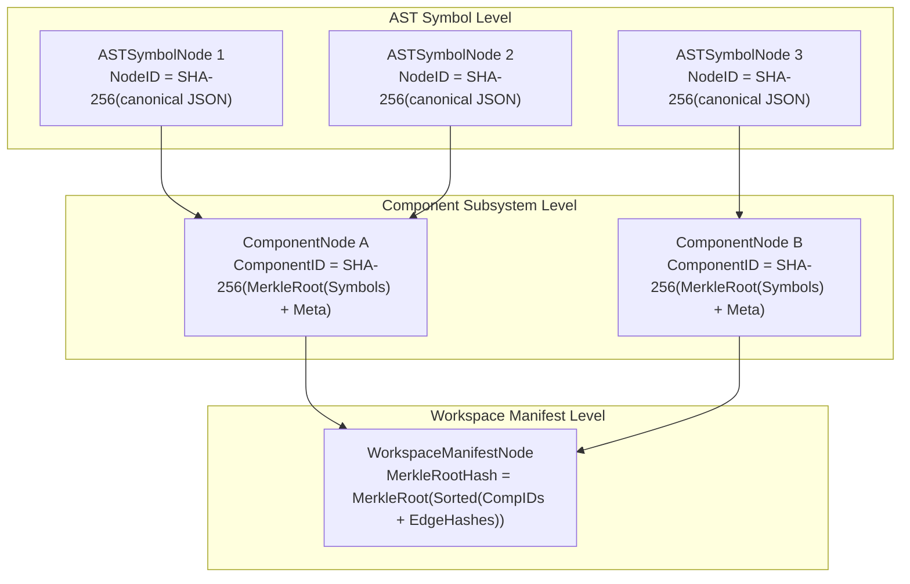

# Schema & Storage Engine Reference

Technical specification of Cosm's internal data structures, Merkle-DAG algorithms, distributed CRDT collaboration models, and durable storage engine.

---

## 1. Core Domain Enums (`pkg/core/schema.go`)

| Enum Type | Defined Constants | Purpose / Semantics |
| :--- | :--- | :--- |
| `Language` | `go`, `typescript`, `python`, `hcl`, `rust`, `java`, `sql`, `protobuf`, `cpp`, `c`, `raw` | Identifies AST codec and language parsing/hydration semantics |
| `ComponentType` | `service`, `library`, `frontend`, `database`, `infra`, `model`, `contract` | Architectural subsystem classification |
| `EdgeType` | `CALLS`, `CONSUMES_API`, `DEPLOYS_TO`, `BINDS_ENV`, `DEPENDS_ON`, `QUERIES_TABLE`, `IMPLEMENTS_RPC` | Semantic cross-boundary dependency link types |
| `BreakageSeverity` | `CRITICAL`, `WARNING`, `INFO` | Impact classification for detected contract violations |
| `BreakageType` | `ROUTE_REMOVED`, `TABLE_REMOVED`, `RPC_REMOVED`, `ENV_VAR_MISSING`, `DEPLOY_TARGET_MISSING` | Category of cross-domain breakage |
| `TargetKind` | `local-service`, `cloud-run`, `static-web`, `terraform-infra`, `composite` | Target build & deployment runtime category |
| `DriftType` | `COMPONENT_ADDED`, `COMPONENT_REMOVED`, `COMPONENT_MODIFIED`, `ENV_VAR_MISSING`, `ENDPOINT_CHANGED`, `RESOURCE_DRIFT` | Classification of target environment drift |
| `COBType` | `proposal`, `review`, `blackboard` | Decentralized collaborative object type |
| `ReviewStatus` | `OPEN`, `UNDER_REVIEW`, `CHANGES_REQUESTED`, `APPROVED`, `MERGED`, `CLOSED` | Proposal review workflow lifecycle status |

---

## 2. Core AST & Merkle-DAG Models (`pkg/core/schema.go`)

### `LineageEnvelope`
Stores unbroken causal provenance metadata bound to every mutation:
```go
type LineageEnvelope struct {
    UserID              string    `json:"user_id,omitempty"`
    UserPrompt          string    `json:"user_prompt,omitempty"`
    SessionID           string    `json:"session_id,omitempty"`
    OrchestratorAgentID string    `json:"orchestrator_agent_id,omitempty"`
    ExecutingAgentID    string    `json:"executing_agent_id,omitempty"`
    LLMVersion          string    `json:"llm_version,omitempty"`
    GenerationParams    string    `json:"generation_params,omitempty"`
    Intent              string    `json:"intent,omitempty"`
    Timestamp           time.Time `json:"timestamp"`
    SignatureEd25519    []byte    `json:"signature_ed25519,omitempty"`
}
```

---

### `ASTSymbolNode`
The discrete atom of the codebase (e.g. function, struct, interface, route binding, SQL table, Terraform resource block, or raw non-AST file):
```go
type ASTSymbolNode struct {
    NodeID            string            `json:"node_id"`            // SHA-256 deterministic content hash
    Language          Language          `json:"language"`           // "go", "hcl", "typescript", "raw", etc.
    NodeType          string            `json:"node_type"`          // e.g. "FunctionDecl", "ResourceBlock", "RawBlobNode"
    Identifier        string            `json:"identifier"`         // Symbol name (or relative file path for RawBlobNode)
    Signature         string            `json:"signature,omitempty"`// e.g. "func(w http.ResponseWriter, r *http.Request)"
    Docstring         string            `json:"docstring,omitempty"`
    Visibility        string            `json:"visibility,omitempty"`// "public", "private", "exported"
    ASTPayload        []byte            `json:"ast_payload"`        // Serialized AST node bytes or verbatim file content
    ASTMetadata       map[string]string `json:"ast_metadata,omitempty"`
    LocalDependencies []string          `json:"local_dependencies,omitempty"` // Symbol IDs depended upon in component
    Dependencies      []string          `json:"dependencies,omitempty"`
    Lineage           LineageEnvelope   `json:"lineage"`
}
```

> [!NOTE]
> **Raw Non-AST Files**: For unstructured files (e.g. `LICENSE`, `README.md`, `.gitignore`, configs, and assets), `NodeType` is set to `"RawBlobNode"`, `Language` is set to `"raw"`, `Identifier` contains the relative file path, and `ASTPayload` stores the exact unparsed byte content. Hydration materializes these nodes verbatim without alteration.

---

### `CrossBoundaryEdge`
Encapsulates typed semantic relationships bridging different programming languages or architectural boundaries:
```go
type CrossBoundaryEdge struct {
    SourceNodeID     string            `json:"source_node_id"`
    TargetNodeID     string            `json:"target_node_id"`
    Type             EdgeType          `json:"type"`             // CALLS, CONSUMES_API, DEPLOYS_TO, etc.
    ContractSchemaID string            `json:"contract_schema_id,omitempty"`
    Metadata         map[string]string `json:"metadata,omitempty"`
    Lineage          LineageEnvelope   `json:"lineage"`
}
```

---

### `ComponentNode`
Subsystem grouping of symbol nodes with its own binary Merkle root:
```go
type ComponentNode struct {
    ComponentID string            `json:"component_id"` // Merkle root hash of sorted symbol hashes
    Name        string            `json:"name"`         // e.g. "services/billing", "frontend/auth"
    Type        ComponentType     `json:"type"`         // service, database, infra, etc.
    Language    Language          `json:"language"`
    SymbolNodes []string          `json:"symbol_nodes"` // List of ASTSymbolNode NodeIDs
    Metadata    map[string]string `json:"metadata,omitempty"`
    Lineage     LineageEnvelope   `json:"lineage"`
}
```

---

### `WorkspaceManifestNode`
The content-addressed Merkle root of an entire micro-universe:
```go
type WorkspaceManifestNode struct {
    WorkspaceID    string              `json:"workspace_id"`
    UniverseID     string              `json:"universe_id"`      // Branch / micro-universe identifier
    MerkleRootHash string              `json:"merkle_root_hash"` // Binary pairwise Merkle root hash
    Components     []string            `json:"components"`       // ComponentNode ComponentIDs
    CrossEdges     []CrossBoundaryEdge `json:"cross_edges"`      // Cross-domain contract edges
    Lineage        LineageEnvelope     `json:"lineage"`
    CreatedAt      time.Time           `json:"created_at"`
}
```

---

## 3. Distributed CRDT & Collaboration Models (`pkg/distributed/`)

### `ProposalCOB` (Collaborative Object)
State-based CRDT representing decentralized proposals with Lamport clocks:
```go
type ProposalCOB struct {
    ID             string               `json:"id"`
    Type           COBType              `json:"type"`             // "proposal"
    Title          string               `json:"title"`
    TargetUniverse string               `json:"target_universe"`  // Base branch
    AuthorDID      string               `json:"author_did"`       // Decentralized ID
    Status         ReviewStatus         `json:"status"`
    CreatedAt      time.Time            `json:"created_at"`
    Revisions      []ProposalRevision   `json:"revisions"`
    Comments       []ReviewComment      `json:"comments"`
    Approvals      map[string]bool      `json:"approvals"`        // DID -> Approved
    FitnessScore   float64              `json:"fitness_score"`
    Lineage        core.LineageEnvelope `json:"lineage"`
    LamportClock   uint64               `json:"lamport_clock"`
}
```

---

### `ASTConflictNode`
Non-blocking first-class conflict node stored directly in the AST Merkle DAG:
```go
type ASTConflictNode struct {
    ConflictID       string               `json:"conflict_id"`
    TargetSymbolID   string               `json:"target_symbol_id"`
    TargetIdentifier string               `json:"target_identifier"`
    Language         core.Language        `json:"language"`
    BaseASTHash      string               `json:"base_ast_hash,omitempty"`
    Conflicting      []ConflictingVersion `json:"conflicting_versions"`
    Resolution       *ConflictingVersion  `json:"resolution,omitempty"`
    ResolvedAt       *time.Time           `json:"resolved_at,omitempty"`
    Status           string               `json:"status"` // "UNRESOLVED", "AUTO_RESOLVED", "MANUAL_RESOLVED"
}
```

---

### `StackedProposal`
Stacked micro-universe changes for dependent pull request workflows:
```go
type StackedProposal struct {
    ChangeID       string               `json:"change_id"`        // e.g. "c/auth-v2"
    ProposalID     string               `json:"proposal_id"`
    Title          string               `json:"title"`
    ParentChangeID string               `json:"parent_change_id"` // Parent change or "root"
    UniverseID     string               `json:"universe_id"`
    ManifestHash   string               `json:"manifest_hash"`
    AuthorDID      string               `json:"author_did"`
    OrderIndex     int                  `json:"order_index"`      // Stack depth
    Lineage        core.LineageEnvelope `json:"lineage"`
    CreatedAt      time.Time            `json:"created_at"`
    UpdatedAt      time.Time            `json:"updated_at"`
}
```

---

## 4. Deterministic Hashing & Merkle Mathematics (`pkg/core/hasher.go`)

Cosm relies on a deterministic, collision-resistant **SHA-256** Merkle-DAG:



### Exact Hashing Formulas:

1. **Lineage Hash**:
   $$\text{Hash}(lin) = \text{SHA256}(\text{UserID} \parallel \text{UserPrompt} \parallel \text{SessionID} \parallel \text{OrchestratorAgentID} \parallel \text{ExecutingAgentID} \parallel \text{LLMVersion} \parallel \text{GenerationParams} \parallel \text{Intent} \parallel \text{Timestamp(RFC3339Nano)})$$

2. **AST Symbol Hash**:
   $$\text{NodeID} = \text{SHA256}(\text{Language} \parallel \text{NodeType} \parallel \text{Identifier} \parallel \text{Signature} \parallel \text{Docstring} \parallel \text{Visibility} \parallel \text{SHA256}(\text{ASTPayload}) \parallel \text{SortedMetadata} \parallel \text{SortedLocalDeps} \parallel \text{HashLineage})$$

3. **Cross-Boundary Edge Hash**:
   $$\text{EdgeHash} = \text{SHA256}(\text{SourceNodeID} \parallel \text{TargetNodeID} \parallel \text{Type} \parallel \text{ContractSchemaID} \parallel \text{SortedMetadata} \parallel \text{HashLineage})$$

4. **Component Merkle Root**:
   $$\text{SymbolMerkleRoot} = \text{ComputeMerkleRoot}(\text{sort}(\text{comp.SymbolNodes}))$$
   $$\text{ComponentID} = \text{SHA256}(\text{Name} \parallel \text{Type} \parallel \text{Language} \parallel \text{SymbolMerkleRoot} \parallel \text{SortedMetadata} \parallel \text{HashLineage})$$

5. **Binary Pairwise Merkle Algorithm (`ComputeMerkleRoot`)**:
   - At each level, odd elements duplicate the final hash ($H_n = H_{n-1}$).
   - Parent nodes: $H_{\text{parent}} = \text{SHA256}(H_{2i} \parallel H_{2i+1})$.
   - Recursion terminates when a single 64-character hexadecimal root is obtained.

---

## 5. Storage Architecture & On-Disk Layout (`pkg/storage/`)

### Directory Layout (`.cosm/`)
```text
.cosm/ (or .fg/)
├── objects/                     # Content-addressed immutable blob store
│   ├── 0a/
│   │   └── 0a8f9c2d1b...bin     # Atomic fsync + rename written blobs
│   └── fc/
│       └── fc3b1a889e...bin
├── storage/
│   ├── graph.db                 # Pure-Go SQLite snapshot graph database
│   ├── graph.db-wal             # Framed binary Write-Ahead Log (FGWA framing)
│   └── vector.db                # Persistent 128-dim vector embedding index
└── attestations/                # Cryptographically signed in-toto v1 provenance files
    └── 4a5f6b...attestation.json
```

---

### Framed Binary WAL Layout (`graph.db-wal`)
The Graph Engine writes mutations with zero CGO using a robust binary framing protocol:

| Byte Offset | Field Name | Data Type | Description |
| :--- | :--- | :--- | :--- |
| `0..3` | **Magic Header** | `uint32` (`0x46475741`) | ASCII `"FGWA"` (Future Git WAL) |
| `4` | **Record Type** | `uint8` | `1` = TxBegin, `2` = Mutation, `3` = TxCommit |
| `5..8` | **Payload Length** | `uint32` (Big Endian) | Byte length of mutation payload $L$ |
| `9..12` | **Checksum** | `uint32` (Big Endian) | IEEE CRC32 checksum over payload |
| `13..(13+L-1)`| **Payload Data** | `[]byte` | Serialized record (`NodeRecord`, `EdgeRecord`, etc.) |

---

### Graph Database Schema (`graph.db`)
```sql
CREATE TABLE IF NOT EXISTS nodes (
    node_id      TEXT PRIMARY KEY,
    language     TEXT NOT NULL,
    node_type    TEXT NOT NULL,
    merkle_hash  TEXT NOT NULL,
    created_at   DATETIME NOT NULL
);

CREATE TABLE IF NOT EXISTS edges (
    source_id    TEXT NOT NULL,
    target_id    TEXT NOT NULL,
    edge_type    TEXT NOT NULL,
    contract_id  TEXT,
    PRIMARY KEY (source_id, target_id, edge_type)
);

CREATE TABLE IF NOT EXISTS lineages (
    record_id              TEXT PRIMARY KEY,
    node_id                TEXT NOT NULL,
    user_id                TEXT,
    user_prompt            TEXT,
    session_id             TEXT,
    orchestrator_agent_id  TEXT,
    executing_agent_id     TEXT,
    llm_version            TEXT,
    generation_params      TEXT,
    intent                 TEXT,
    timestamp              DATETIME NOT NULL,
    signature_ed25519      BLOB
);

CREATE TABLE IF NOT EXISTS universe_heads (
    universe_id       TEXT PRIMARY KEY,
    merkle_root_hash  TEXT NOT NULL,
    updated_at        DATETIME NOT NULL
);
```

---

### Event-Sourced Oplog Engine (`pkg/storage/oplog.go`)
Every transaction logs reversible `OplogEvent` records supporting deterministic replay, rollbacks, and undo trees:
```go
type OplogEvent struct {
    EventID      uint64      `json:"event_id"`      // Monotonically increasing counter
    EventUUID    string      `json:"event_uuid"`    // Globally unique ID
    UniverseID   string      `json:"universe_id"`   // Target micro-universe
    Action       OplogAction `json:"action"`        // CREATE_NODE, DELETE_NODE, ADD_EDGE, etc.
    EntityID     string      `json:"entity_id"`     // NodeID or Edge composite key
    Payload      string      `json:"payload"`       // Forward change payload
    UndoPayload  string      `json:"undo_payload"`  // Inverse payload for instant rollback
    TimestampMs  int64       `json:"timestamp_ms"`
}
```

---

### Vector Database & Semantic Embedder (`pkg/storage/vectorindex.go`)
- **Embedding Dimensions**: 128-dimensional dense vectors.
- **Offline Generation**: Built-in `DeterministicEmbedder` hashes character trigrams and subword tokens into L2-normalized float arrays without external model API calls.
- **Similarity Metric**: Cosine Similarity:
  $$\text{Sim}(\vec{u}, \vec{v}) = \frac{\vec{u} \cdot \vec{v}}{\|\vec{u}\|_2 \|\vec{v}\|_2}$$
