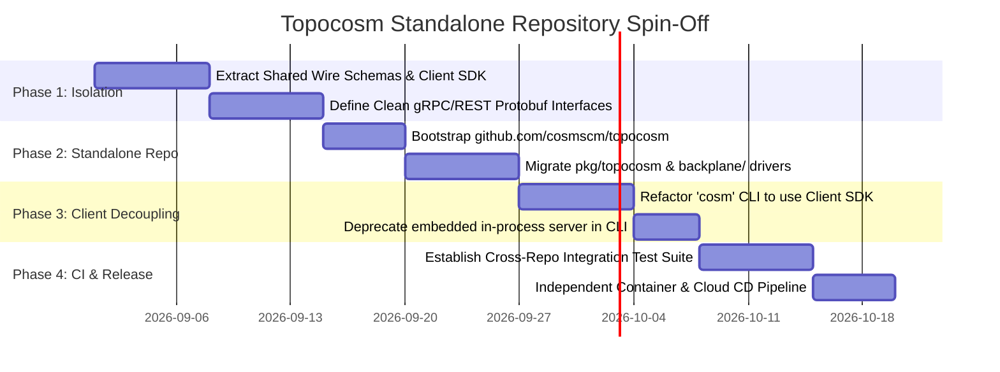

# Topocosm Spin-Off Roadmap & Standalone Architecture Plan

This document outlines the phased engineering roadmap for spinning off **Topocosm (`topocosm.dev`)** from the core `cosm` monorepo into an independent repository (`github.com/cosmscm/topocosm`).

---

## 1. Motivation & System Boundaries

### Why Spin Off Topocosm?
* **Zero-Dependency Local Engine**: `cosm` must remain a pure-Go, ultra-fast, zero-cloud SCM engine capable of running completely offline on laptops and hermetic CI runners without network or cloud infrastructure dependencies.
* **Specialized Cloud Backplane**: `topocosm` serves enterprise multi-tenancy, S3/R2 CAS distribution, CockroachDB/Spanner metadata indices, NATS JetStream event meshes, and Firecracker sandboxes.
* **Independent Release Cycles**: The CLI tool (`cosm`) and the distributed cloud hub (`topocosm`) have different deployment velocities, security models, and scaling profiles.

```
┌────────────────────────────────────────────────────────┐
│               COSM REPO (Local AST SCM)                │
│  github.com/cosmscm/cosm                               │
│                                                        │
│  • AST Codecs (Go, TS, Py, HCL, Rust, Protobuf)        │
│  • Local CAS Blobstore (.cosm/objects/)                │
│  • SQLite WAL Graph Database (.cosm/graph.db)          │
│  • Surgical AST Mutation Engine (9 Geometric Verbs)    │
│  • Materialization & Local Git Shim                    │
│  • Target Shipping & Preview Sandboxes                 │
└───────────────────────────┬────────────────────────────┘
                            │
               Shared Wire Protocol & DTOs
               (github.com/cosmscm/cosm/pkg/api)
                            │
                            ▼
┌────────────────────────────────────────────────────────┐
│             TOPOCOSM REPO (Distributed Hub)            │
│  github.com/cosmscm/topocosm                           │
│                                                        │
│  • Hub Server & gRPC/REST APIs (/api/v1/)              │
│  • Agent Discovery Protocol (/.well-known/)            │
│  • Distributed Blackboard Domain Leases                │
│  • Sparse Subtree Distribution Engine                  │
│  • Multi-Peer CRDT Proposal Convergence (COBs)         │
│  • Cloud Backplane (S3, CockroachDB, NATS, Redis)      │
└────────────────────────────────────────────────────────┘
```

---

## 2. Phased Migration Roadmap



### Phase 1: Contract & Client SDK Decoupling
* Isolate shared data structures into `pkg/core` and `pkg/api`.
* Define canonical wire DTOs:
  * `PublishPayload` / `PublishResponse`
  * `SparsePullRequest` / `SparsePullResponse`
  * `ProposalCOB` / `ReviewSubmission`
  * `BlackboardClaimRequest` / `BlackboardReleaseRequest`
* Ensure `pkg/api/client.go` communicates exclusively over standard HTTP/REST and gRPC, with zero direct memory references to server state.

### Phase 2: Standalone Repository Bootstrap
* Initialize `github.com/cosmscm/topocosm`.
* Import core packages:
  * `cmd/topocosm/` (Server daemon binary)
  * `pkg/server/` (HTTP/REST/gRPC router & handlers)
  * `pkg/backplane/` (Local SQLite + Cloud S3/CockroachDB/NATS backplanes)
  * `pkg/discovery/` (Agent discovery manifest and attestation policies)
* Include Go module dependency: `require github.com/cosmscm/cosm v1.x` for shared AST core schemas.

### Phase 3: Cosm CLI Decoupling
* Retain developer commands in `cosm` as thin network client calls:
  * `cosm clone <hub_url>/<org>/<cosm>` $\rightarrow$ calls `POST /api/v1/cosms/{org}/{cosm}/pull`
  * `cosm publish <hub_url>/<org>/<cosm>` $\rightarrow$ calls `POST /api/v1/cosms/{org}/{cosm}/publish`
  * `cosm claim <domain>` $\rightarrow$ calls `POST /api/v1/cosms/{org}/{cosm}/blackboard/claim`
* For local offline development, provide a lightweight zero-cloud sidecar binary (`topocosm-dev`) or embedded local mock in `test/agents/`.

### Phase 4: CI/CD & Compatibility Matrix
* Configure hermetic cross-repository integration tests:
  * Matrix test: `cosm` (v1.0, v1.1) against `topocosm` (v1.0, v1.1).
  * Automated protocol compliance checks for `/.well-known/cosm-agent.json`.
* Publish standalone container images: `ghcr.io/cosmscm/topocosm:latest`.

### Phase 5: Production Deployment & Federation Mesh
* Deploy multi-tenant `topocosm.dev` infrastructure:
  * Global CDN caching for immutable CAS AST blobs.
  * Multi-region CockroachDB for universe graph heads and contract edges.
  * NATS JetStream cluster for real-time agent swarm coordination.

---

## 3. Package Extraction Map

| Current In-Tree Path (`cosm`) | New Standalone Path (`topocosm`) | Responsibility |
| :--- | :--- | :--- |
| `pkg/topocosm/server.go` | `pkg/server/server.go` | HTTP/REST & gRPC routing and middleware |
| `pkg/topocosm/schema.go` | `pkg/types/schema.go` | Hub wire contracts, user accounts, orgs |
| `pkg/topocosm/backplane/` | `pkg/backplane/` | Storage backplane implementations |
| `pkg/topocosm/seeder.go` | `pkg/dev/seeder.go` | Local development mock data generator |
| `pkg/topocosm/swarm_simulator.go` | `pkg/benchmarks/swarm.go` | Multi-agent concurrency benchmark harness |
| `pkg/topocosm/client.go` | Remains in `cosm/pkg/api/client.go` | Client SDK used by CLI and AI worker agents |

---

## 4. API Wire Protocol Invariants

The API between `cosm` and `topocosm` is versioned at `/api/v1/` and remains strictly backward-compatible:

```
TOPOLOGICAL PROTOCOL SPECIFICATION (v1)
├── GET  /.well-known/cosm-agent.json             (Capability & Policy Discovery)
├── POST /api/v1/auth/enroll                      (Ed25519 DID Attestation)
├── GET  /api/v1/cosms                            (Repository Catalog)
├── POST /api/v1/cosms/{org}/{cosm}/publish       (Atomic CAS & Manifest Upload)
├── POST /api/v1/cosms/{org}/{cosm}/pull          (Full Merkle DAG Sync)
├── POST /api/v1/cosms/{org}/{cosm}/sparse-pull   (Filtered Subgraph Sync)
├── POST /api/v1/cosms/{org}/{cosm}/proposals     (CRDT Proposal COB Ingestion)
├── POST /api/v1/cosms/{org}/{cosm}/proposals/{id}/review (Critic Scorecard & Approvals)
├── POST /api/v1/cosms/{org}/{cosm}/blackboard/claim      (Exclusive Domain Lease)
└── GET  /git/{org}/{cosm}.git/info/refs          (Git Smart-HTTP Protocol Shim)
```
