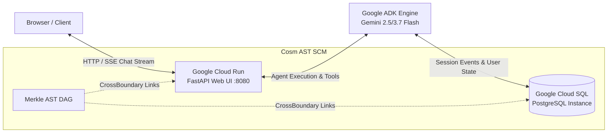

# Google ADK Agent on Cloud Run with Cloud SQL Memory & Cosm AST SCM

This reference project demonstrates building a state-aware AI Agent with **Google Agent Development Kit (ADK)** and Gemini models, deploying it with an interactive Web UI to **Google Cloud Run**, persisting conversation memory across sessions in **Google Cloud SQL (PostgreSQL)**, and managing code topology and causal lineage with **Cosm AST SCM**.

---

## Architecture Overview



### Memory Layers

| Scope | Prefix | Storage Table | Behavior |
| :--- | :--- | :--- | :--- |
| **Session Scratchpad** | `session_goal`, `notes` | `session_states` | Scoped to active conversation. Reset when user starts a new session. |
| **User Memory** | `user:preferred_name`, `user:coding_language` | `user_states` | Scoped to `user_id`. Persists across all future sessions for that user. |
| **Event Transcript** | `events` | `events` | Chronological immutable log of user messages, agent responses, and tool calls. |

---

## Directory Structure

```
adk_cloudrun_cloudsql/
├── .env.example             # Environment variable template for GCP & Gemini credentials
├── .env                     # Local environment settings
├── pyproject.toml           # Python dependencies (google-adk, fastapi, sqlalchemy, asyncpg)
├── Containerfile            # Multi-stage Cloud Run container build
├── app/
│   ├── __init__.py
│   ├── agent.py             # Google ADK Agent definition with Gemini & ToolContext
│   ├── database.py          # Cloud SQL / PostgreSQL session manager & SQLite fallback
│   ├── main.py              # FastAPI server exposing Web UI and REST endpoints
│   ├── static/
│   │   └── index.html       # Interactive chat UI with live Cloud SQL memory inspector
│   └── tools/
│       ├── __init__.py
│       └── memory_tools.py  # User memory ('user:*') and session goal tools
├── infra/
│   ├── main.tf              # Terraform for Cloud Run, Cloud SQL Postgres, Secret Manager
│   ├── variables.tf         # Configurable GCP project, region, database tier
│   └── outputs.tf           # Cloud Run URL and Cloud SQL connection name
├── tests/
│   ├── test_agent.py        # Unit tests for ADK agent & tool invocation
│   ├── test_database_memory.py # Integration tests for session vs user memory persistence
│   └── test_api.py          # Tests for FastAPI endpoints & chat pipeline
└── README.md
```

---

## Quickstart: Local Development

### 1. Setup Environment
```bash
cp .env.example .env
# Fill in your GEMINI_API_KEY if testing with live Gemini models
```

### 2. Run Tests
```bash
# Run unit & integration test suite
python3 -m unittest discover -s tests -p "test_*.py" -v
```

### 3. Launch Local Server
```bash
python3 -m app.main
# Open http://localhost:8080 in your browser to interact with the Web UI
```

---

## Cosm AST SCM Tracking

Cosm tracks polyglot symbol graphs (Python agent logic $\leftrightarrow$ Terraform infrastructure $\leftrightarrow$ WebUI assets) as content-addressed AST Merkle-DAGs.

```bash
# 1. Initialize Cosm repository
cosm init

# 2. Stage Python and Terraform files into AST symbol nodes
cosm add app/agent.py app/main.py infra/main.tf

# 3. Commit with causal lineage
cosm commit -i "Implement Google ADK agent with Cloud SQL memory and Cloud Run deployment"

# 4. View cross-domain topology graph
cosm topology

# 5. Audit symbol blast radius before making changes
cosm blast-radius app/agent.py

# 6. Publish AST universe to Topocosm Hub
cosm publish https://topocosm.dev/my-org/adk-cloudrun-agent
```

---

## Production Deployment to Google Cloud Run

### Option A: Using Terraform
```bash
cd infra
terraform init
terraform plan -var="project_id=YOUR_GCP_PROJECT_ID"
terraform apply -var="project_id=YOUR_GCP_PROJECT_ID"
```

### Option B: Using gcloud CLI
```bash
# 1. Build & submit container image
gcloud builds submit --tag gcr.io/YOUR_GCP_PROJECT_ID/adk-agent-service:latest .

# 2. Deploy to Cloud Run with Cloud SQL connection
gcloud run deploy adk-agent-service \
  --image gcr.io/YOUR_GCP_PROJECT_ID/adk-agent-service:latest \
  --region us-central1 \
  --allow-unauthenticated \
  --add-cloudsql-instances YOUR_GCP_PROJECT_ID:us-central1:adk-postgres-instance \
  --set-env-vars "CLOUD_SQL_CONNECTION_NAME=YOUR_GCP_PROJECT_ID:us-central1:adk-postgres-instance,DB_USER=adk_agent_user,DB_NAME=adk_agent_db" \
  --set-secrets "DB_PASSWORD=adk-db-password:latest,GEMINI_API_KEY=gemini-api-key:latest"
```
